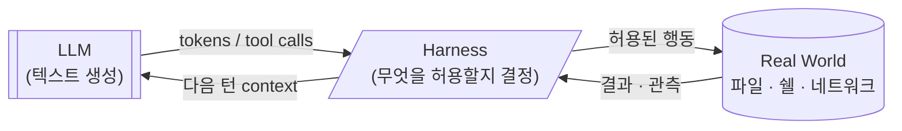
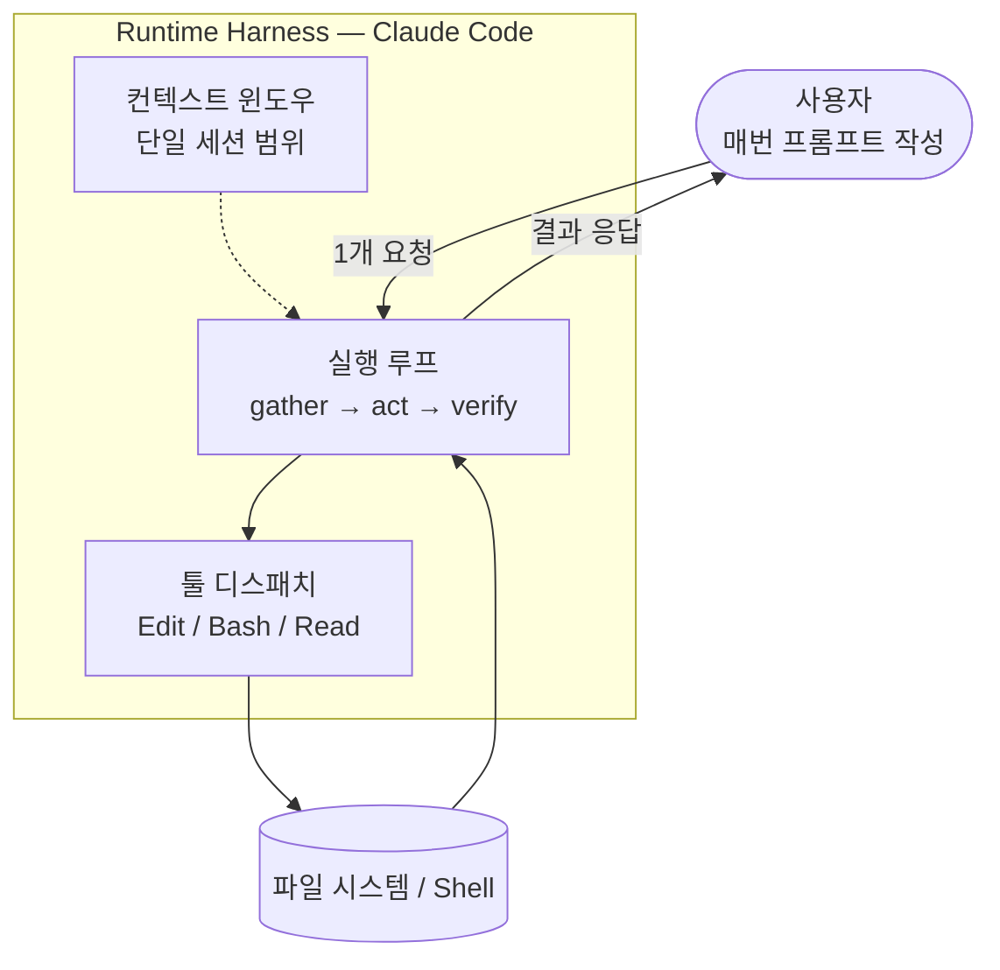
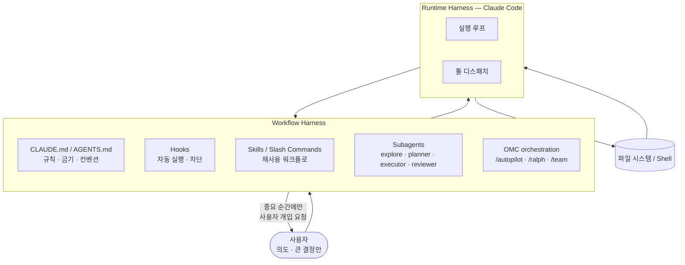

<Callout type="info">
**이 글을 먼저 읽어야 하는 이유**
CC CORE의 나머지 카테고리(Slash Commands, Workflows, Git & Versioning 등)는 전부 **"하네스를 어떻게 설계할까"** 라는 하나의 질문에 대한 답입니다. 그 질문이 어디서 나왔는지, 왜 지금 중요한지 먼저 짚고 가면 다른 글들이 훨씬 잘 읽힙니다.
</Callout>

## 1. "하네스(harness)"는 어디서 온 말인가

AI 코딩 에이전트 업계에서 **harness** 라는 표현은 최근 1년 사이에 업계 공용 단어로 자리 잡았습니다. 원래 harness는 "말을 마차에 묶는 마구(馬具)" 혹은 "안전벨트" 같이 **무언가를 단단히 묶어서 다루기 쉽게 만드는 장치**를 뜻하는 영어 단어예요.

2025년 말 Anthropic 엔지니어링 블로그가 [Effective harnesses for long-running agents](https://www.anthropic.com/engineering/effective-harnesses-for-long-running-agents) (2025-11-26) 를 공개한 시점에 이미 harness 는 **인프라 수준의 기본 어휘**였어요. 2026년 초 Mitchell Hashimoto 가 "engineering the harness" 라는 실천을 제시하고, [HumanLayer](https://www.humanlayer.dev/blog/skill-issue-harness-engineering-for-coding-agents) (2026-03-12), [Birgitta Böckeler / Martin Fowler](https://martinfowler.com/articles/harness-engineering.html) (2026-04-02) 를 거치며 주류 어휘로 편입됐습니다.

이 진화 흐름의 가장 정리된 한국어 분석은 Jonas Kim 의 [에이전틱 패턴의 진화](https://bits-bytes-nn.github.io/insights/agentic-ai/2026/04/05/evolution-of-ai-agentic-patterns.html) (2026-04-05, [GeekNews 요약](https://news.hada.io/topic?id=28301)) 입니다. 섹션 5 에서 이 글의 "엄밀함의 이동" 프레임을 다시 다룹니다.

이 분야의 "한 줄 정의" 에 가장 가까운 구절은 HumanLayer 블로그가 Hashimoto 를 인용한 부분이에요.

> "Anytime you find an agent makes a mistake, you take the time to engineer a solution such that the agent never makes that mistake again."
> — Mitchell Hashimoto (via HumanLayer, 2026-03-12)

즉, harness engineering 은 **"프롬프트 고쳐주기" 가 아니라 "환경 자체를 바꿔서 실수의 재발 가능성을 없애기"** 라는 실천 철학입니다.

<Callout type="warn" title="공식 문서엔 안 나오는 관점">
Anthropic 공식 문서는 Hooks, Skills, MCP 같은 기능을 **기능 단위**로 설명합니다. 하지만 "왜 이것들이 한꺼번에 존재하는가"는 말해주지 않아요. harness engineering 프레임은 그 "왜"에 답해주는 관점입니다. 기능이 아니라 **철학**을 먼저 잡는 게, 결과적으로 기능을 더 잘 쓰게 만듭니다.
</Callout>

## 2. 하네스는 정확히 무엇을 감싸는가

가장 깔끔한 한 줄 정의는 WaveSpeed AI 의 표현에서 나옵니다.

> "An agent harness is everything between the language model and the real world. The model generates text. The harness decides what that text can touch."
> — [WaveSpeed AI, 2026-04-06](https://wavespeed.ai/blog/posts/claude-code-agent-harness-architecture/)

**모델은 텍스트를 뱉는다. 하네스는 그 텍스트가 만질 수 있는 걸 결정한다.** 이게 전부예요.



그래서 harness 안에 들어가는 것들은 대략 이런 카테고리입니다.

- **실행 루프** — "응답 → 툴 호출 → 결과 → 다음 응답" 을 반복하는 엔진
- **툴 디스패치** — 파일 읽기·쓰기·Bash·브라우저 자동화 같은 "손"들
- **컨텍스트 관리** — 컨텍스트 윈도우에 무엇을 넣고 뭘 압축할지 결정
- **권한·안전 장치** — 어떤 명령어를 막을지, 어떤 경로를 보호할지
- **세션·메모리** — 턴 사이, 세션 사이에 뭘 기억할지
- **오케스트레이션** — 여러 에이전트 간 역할 분담과 결과 합성
- **피드백 루프** — 테스트·린터·리뷰어 같은 검증 장치

Ken Huang 의 Substack 글 ([The Claude Code Leak: 10 Agentic AI Harness Patterns](https://kenhuangus.substack.com/p/the-claude-code-leak-10-agentic-ai), 2026-04-01) 은 이를 한 줄로 정리합니다: **"모델은 지능을 제공하고, 하네스는 통제력을 제공한다."** 두 개는 별개의 축이고, 우리가 설계하는 건 후자예요.

## 3. Runtime harness vs Workflow harness — CC CORE 의 구분

위에 나열한 "하네스 구성요소"들을 통째로 다루려고 하면 범위가 너무 넓어서, CC CORE 는 **두 층**으로 나눠서 접근합니다.

<Callout type="warn" title="이 구분은 CC CORE의 자체 프레임입니다">
"runtime harness" vs "workflow harness" 라는 정확히 이 두 이름 쌍을 쓴 선행 출처는 **없어요.** 이건 harness 논의를 한국어 독자에게 명확하게 전달하기 위해 CC CORE 가 제안하는 구조적 명명입니다. 다만 개념 자체는 여러 출처에서 공통으로 발견되는 구분이고, 특히 [Anthropic 엔지니어링 포스트](https://www.anthropic.com/engineering/effective-harnesses-for-long-running-agents) 가 "initializer agent vs coding agent" 의 이름으로 비슷한 분리를, [Birgitta Böckeler 의 Martin Fowler 글](https://martinfowler.com/articles/harness-engineering.html) 이 "guides + sensors" 의 은유로 유사한 층화를 이미 사용하고 있습니다.
</Callout>

### 3-1. Runtime harness — "모델을 돌릴 수 있게 감싼 얇은 껍데기"

실행 루프, 툴 디스패치, 기본 권한 체크, 단일 세션 안의 컨텍스트 관리 — 즉 **"모델 하나가 한 번 동작하는 데 필요한 모든 것"** 입니다.



여기에 해당하는 도구들:

- **Claude Code**
- **Cursor**
- **Windsurf**
- **Codex CLI**
- **Gemini CLI**
- **Aider**

[Geoffrey Huntley](https://ghuntley.com/agent/) 는 harness 를 "LLM 토큰을 받아 루프를 도는 코드 라인들 — 모델이 무거운 일을 다 하고 harness 는 얇은 껍데기" 로 포지셔닝합니다. Anthropic 공식 [Claude Code overview](https://code.claude.com/docs/en/overview) 도 Claude Code 를 gather context → take action → verify work → repeat 의 피드백 루프를 도는 "agentic coding tool" 로 설명해요.

Anthropic 의 [Claude Agent SDK 설계 원칙](https://www.anthropic.com/engineering/building-agents-with-the-claude-agent-sdk) 은 "에이전트에게 컴퓨터를 주는 것 (give your agents a computer)" 으로 요약됩니다. runtime harness 의 역할을 한 문장으로 요약한 표현이에요.

### 3-2. Workflow harness — "runtime 위에 쌓은 조직·습관·철학"

Runtime harness 만 있으면 사용자는 매번 직접 지시해야 합니다. Workflow harness 는 그 위에 한 층 더 쌓아서 **"같은 상황에선 같은 방식으로 움직이게"** 만드는 레이어입니다.



여기에 들어가는 것들:

- **`CLAUDE.md` / `AGENTS.md`** — 규칙·금기·프로젝트 특성을 영구 기록
- **Hooks** — 특정 이벤트에서 자동 실행되는 검증·보호·주입 장치
- **Skills / Slash Commands** — 자주 쓰는 프롬프트 패턴의 이름 붙인 재사용 단위
- **Subagents / Task tool** — 역할 분담을 통해 한 메인 에이전트가 다 하지 않게 만드는 구조
- **OMC 같은 오케스트레이션 레이어** — 여러 subagent 를 파이프라인으로 엮어주는 플러그인 모음

### 3-3. 같은 작업, 두 층의 차이

**"새 API 엔드포인트를 만들고 테스트 붙이고 커밋한다"** 를 예로 들면:

| 단계 | Runtime harness 만 (퓨어) | Runtime + Workflow harness |
|---|---|---|
| 요구사항 정리 | 사용자가 매번 프롬프트 작성 | `/deep-interview` 가 Socratic Q&A 로 자동화 |
| 설계 | 매번 구두 지시 | `planner` subagent 전담 |
| 구현 | 사용자 감독하며 진행 | `executor` subagent 가 병렬 진행 |
| 린트·포맷 | 매번 "린트 돌려줘" 라고 말해야 함 | Hook 으로 자동 실행 |
| 테스트 | 사용자가 "테스트도 써줘" 요구 | `test-engineer` subagent 가 알아서 |
| 리뷰 | 사용자가 직접 검수 | `code-reviewer` subagent 1차 검수 |
| 커밋 메시지 | 사용자 직접 작성 | commitlint + husky + Conventional Commits |

차이의 본질은 **사용자 개입 지점의 개수**예요. Böckeler 가 Martin Fowler 글에서 가장 아름답게 정리했습니다.

> "A good harness should not necessarily aim to fully eliminate human input, but to direct it to where our input is most important."
> — [Birgitta Böckeler, 2026-04-02](https://martinfowler.com/articles/harness-engineering.html)

**좋은 하네스의 목표는 "사람의 개입을 없애는 것" 이 아니라 "사람의 개입이 가장 중요한 지점으로 유도하는 것".** 이 관점을 가지면 "전부 자동화" 와 "전부 수동" 사이의 건강한 중간값을 찾을 수 있습니다.

## 4. OMC 는 workflow harness 의 기성품

[oh-my-claudecode (OMC)](https://github.com/Yeachan-Heo/oh-my-claudecode) 는 **"Claude Code 를 대체하는 도구"** 가 아니라 **"Claude Code 위에 얹은 조직화 레이어"** 입니다. runtime harness 는 그대로 두고 그 위에 workflow harness 를 덧씌워주는 패키지예요. Skills, Subagent 카탈로그, Magic Keyword 라우팅, 상태 관리 — 직접 만들기 귀찮은 workflow harness 구성요소를 플러그인 한 번 설치로 가져다 쓸 수 있게 해줍니다. 자세한 카탈로그는 [OMC 슬래시 커맨드 카탈로그](/docs/02-slash-commands/omc-catalog) 참고.

## 5. 프롬프트에서 컨텍스트로, 컨텍스트에서 하네스로

"그럼 프롬프트 엔지니어링이나 컨텍스트 엔지니어링이랑 뭐가 달라요?" Jonas Kim 의 [에이전틱 패턴 진화 분석](https://bits-bytes-nn.github.io/insights/agentic-ai/2026/04/05/evolution-of-ai-agentic-patterns.html) 이 가장 명료한 답을 줍니다. 핵심 명제는 Chad Fowler 의 "Relocating Rigor" 개념을 빌려옵니다:

> "엔지니어링의 엄밀함은 사라지지 않는다 — 이동할 뿐이다."
> — Jonas Kim, 2026-04-05 (Chad Fowler 의 "Relocating Rigor" 개념을 인용)

| 시대 | 초점 | 한계 |
|---|---|---|
| **Prompt engineering** (2022-2024) | 단일 프롬프트 표현 | 같은 프롬프트가 다음 턴에 무너짐 |
| **Context engineering** (2025) | 컨텍스트 윈도우 큐레이션 | 한 세션 안에서만 유효, 시스템 전체엔 답 못 줌 |
| **Harness engineering** (2026~) | 시스템 전체 — 도구·권한·피드백 루프 | (현재) |

각 시대는 이전 시대의 한계 때문에 촉발됐어요. 프롬프트만 잘 써도 안 되니까 컨텍스트로 갔고, 컨텍스트만 잘 채워도 안 되니까 하네스로 옮겨간 거죠. HumanLayer 의 단순 수식이 이 관계를 압축합니다:

```
coding agent = AI model(s) + harness
```

Harness engineering 은 **context engineering 의 상위 개념**입니다. 컨텍스트 윈도우 관리는 harness 의 한 부분일 뿐이고, harness 에는 툴 설정, 권한 설계, 피드백 루프(테스트·린터), 세션 아키텍처까지 포함되니까요.

## 6. 왜 지금 이게 중요한가

2025~2026년 들어 AI 코딩 에이전트의 **모델 성능 향상 속도**는 개별 사용자가 따라잡기 버거운 수준이 됐습니다. 그런데 **도구를 잘 쓰는 사람과 못 쓰는 사람의 생산성 격차**는 오히려 더 벌어지고 있어요. 왜일까요?

- 모델은 똑같이 좋은데
- 누구는 "채팅창"처럼 쓰고
- 누구는 `CLAUDE.md` 30줄 + Hook 5개 + 커스텀 Skill 2개 + OMC 로 **자기한테 맞춘 workflow harness** 를 쌓아놓고 씀

결과물의 차이는 전부 그 harness 설계에서 나옵니다. Hashimoto 가 "engineering the harness" 를 강조한 이유이고, CC CORE 가 존재하는 이유이기도 해요.

<Callout type="warn" title="공식 문서엔 없는 시각: 프롬프트 엔지니어링 vs 하네스 엔지니어링">
블로그나 유튜브는 "프롬프트 엔지니어링" 을 많이 다룹니다. 하지만 프롬프트는 **일회용** 이에요. 한 번 잘 쓰고 나면 그걸로 끝.
Harness 는 **영속적** 입니다. 한 번 잘 만들어두면 이후 모든 세션에 **복리**로 작용합니다. 같은 시간을 투자했을 때, 장기 수익률은 harness engineering 쪽이 훨씬 높습니다. 이건 대부분의 공식 문서나 튜토리얼이 명시적으로 알려주지 않는 관점이에요.
</Callout>

## 다음에 읽을 글

- [Docs Summary — Claude Code 공식 문서 한국어 요약](/docs/01-docs-summary)
- [Workflows — 바이브코딩 풀 파이프라인](/docs/04-workflows)

---

## 참고 자료 (Primary sources, 2025-2026)

**"Harness" 용어의 정립·대중화:**
- [Effective harnesses for long-running agents](https://www.anthropic.com/engineering/effective-harnesses-for-long-running-agents) — Anthropic Engineering, 2025-11-26
- [Skill Issue: Harness Engineering for Coding Agents](https://www.humanlayer.dev/blog/skill-issue-harness-engineering-for-coding-agents) — HumanLayer, 2026-03-12
- [Harness engineering for coding agent users](https://martinfowler.com/articles/harness-engineering.html) — Birgitta Böckeler (Thoughtworks) / Martin Fowler, 2026-04-02

**아키텍처 분석:**
- [Claude Code Agent Harness: Architecture Breakdown](https://wavespeed.ai/blog/posts/claude-code-agent-harness-architecture/) — WaveSpeed AI, 2026-04-06
- [The Claude Code Leak: 10 Agentic AI Harness Patterns](https://kenhuangus.substack.com/p/the-claude-code-leak-10-agentic-ai) — Ken Huang, 2026-04-01

**개념적 배경:**
- [Evolution of AI Agentic Patterns: From Prompts to Harnesses](https://bits-bytes-nn.github.io/insights/agentic-ai/2026/04/05/evolution-of-ai-agentic-patterns.html) — Jonas Kim, 2026-04-05 (엄밀함의 이동) · [GeekNews 요약](https://news.hada.io/topic?id=28301)
- [Geoffrey Huntley — Agent workshop](https://ghuntley.com/agent/) — harness 어휘의 일관된 사용 예시
- [Claude Code overview](https://code.claude.com/docs/en/overview) — Anthropic 공식 소개
- [Building agents with the Claude Agent SDK](https://www.anthropic.com/engineering/building-agents-with-the-claude-agent-sdk) — Anthropic Engineering

**OMC 관련:**
- [oh-my-claudecode GitHub](https://github.com/Yeachan-Heo/oh-my-claudecode) — OMC 공식 레포
- [OMC Docs](https://omc.vibetip.help/docs) — OMC 공식 문서

---

<Callout type="info">
**Last verified: 2026-04-15** — Claude Code v2.1.109 / OMC v4.11.6 기준. 인용 출처는 2025-11부터 2026-04 사이에 발행된 primary source 로 제한했습니다.
</Callout>
