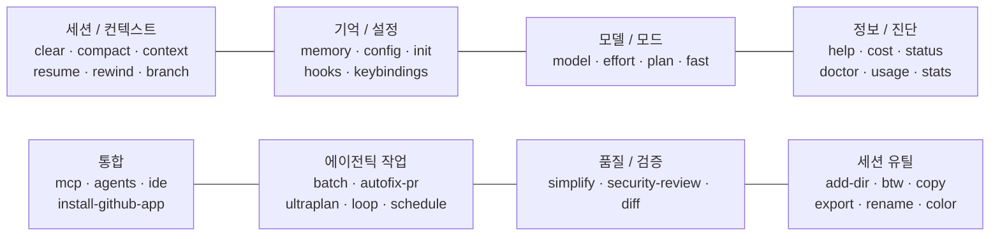

<Callout type="info">
이 글은 "이 상황에 쓰는 커맨드가 뭐였지?" 할 때 펼쳐보는 레퍼런스입니다. 전체를 한 번에 외울 필요는 없고, **목적별 6개 클러스터**만 머릿속에 넣어두면 나머지는 필요할 때 `/help` 로 찾게 돼요.
</Callout>

## 0. 이 글을 읽기 전 알아야 할 것

- 모든 커맨드는 **세션(프롬프트 입력창)** 에서 `/` 를 치면 자동완성 목록이 뜹니다. CLI 플래그(`claude --print` 같은 것)와는 다른 레이어예요. CLI 쪽은 [공식 CLI Reference](https://code.claude.com/docs/en/cli-reference) 참고.
- 여기 나열한 커맨드는 **Claude Code v2.x (2026-04 기준)** 에 실제로 존재하는 것만 담았습니다. 블로그·유튜브에 돌아다니는 구버전 가이드에는 제거된 커맨드(`/pr-comments`, `/vim` 등)가 아직 살아있으니 주의.
- [공식 Commands 문서](https://code.claude.com/docs/en/commands) 가 1차 출처. 이 글은 그걸 한국어로 재구성하고, **공식 문서가 한 줄로만 언급해서 그냥 지나치기 쉬운 부분**을 뽑아내는 게 목적.

## 1. 목적별 클러스터 맵

커맨드가 30개 넘어가니까 알파벳순으로 외우면 망합니다. **"지금 뭘 하고 싶지?"** 에서 출발하세요.



이 8개 클러스터만 기억하면 `/help` 에서 구체 이름을 찾는 건 금방이에요. 아래부터 클러스터별로 본격적으로 봅니다.

## 2. 세션 · 컨텍스트 — 가장 자주 쓰는 것들

Claude Code 생산성의 절반은 **"컨텍스트를 언제 어떻게 리셋하는가"** 에서 갈려요. 이 카테고리는 진지하게 외워둘 가치가 있습니다.

### `/clear` — 완전 초기화

- 대화 기록 전체를 날리고 컨텍스트를 회수합니다. 별칭: `/reset`, `/new`.
- **작업이 바뀔 때마다** 치는 게 권장 패턴이에요. 컨텍스트 찌꺼기가 남으면 추론 품질이 미묘하게 떨어집니다.
- 대화를 살리고 싶다면 `/clear` 대신 `/compact` 를 쓰세요.

### `/compact [instructions]` — 유지 대상을 지정하는 요약

- 오래된 턴을 요약해서 토큰을 회수하되, 대화 연속성은 보존합니다.
- 인자를 넣으면 무엇을 남길지 **명시적으로 지시**할 수 있어요. 예: `/compact retain all TypeScript type definitions and the API contract we discussed`.
- v2.0.64 이후로는 compaction 이 즉시 끝납니다(과거엔 몇 초 걸렸음).

### `/context` — 지금 컨텍스트가 얼마나 차 있는지 시각화

- 컬러 그리드로 컨텍스트 사용률과 최적화 힌트를 보여줍니다.
- "응답이 점점 뭉개지는 느낌" 이 들면 일단 `/context` 부터. 80% 넘었으면 `/compact` 타이밍이에요.

### `/resume [session]` / `/continue`

- 세션 ID 나 이름으로 이전 대화를 복원합니다. 인자 없이 치면 인터랙티브 피커가 뜨고요.
- 세션은 `~/.claude/projects/` 아래에 저장되니 쉘에서 직접 뒤져볼 수도 있어요. CLI 에서 바로 `claude -r "session-name"` 로 불러올 수도 있습니다.

### `/rewind` / `/checkpoint` — 체크포인트 롤백

- 대화만, 코드만, 혹은 둘 다 이전 체크포인트로 되돌립니다.
- Claude 가 잘못된 방향으로 간 직후 가장 먼저 손이 가야 할 커맨드.

### `/branch [name]` / `/fork` — 현재 지점에서 대화 분기

- 같은 시작점에서 두 가지 접근을 시도해보고 싶을 때. 둘 중 어느 쪽도 잃지 않고 비교 가능.

<Callout type="warn" title="공식 문서엔 안 나오는 팁: /compact 인자의 구체성">
`/compact` 가 인자를 받는다는 건 [공식 문서](https://code.claude.com/docs/en/commands) 에 한 줄로만 적혀 있고, **"인자에 뭘 넣어야 효과적인가"** 에 대한 가이드는 없습니다. 커뮤니티에서 검증된 팁은 이거예요: **모호한 지시가 아니라 아주 구체적인 지시**를 넣을 것. "중요한 거 남겨" 같은 건 효과가 약하고, "kept exact API response shape we discussed for /users/:id, including the pagination fields" 처럼 **남겨야 할 구체적 항목을 명시** 하면 compaction 이후에도 Claude 가 그 부분을 정확히 기억합니다. 출처: [Smartscope reference guide](https://smartscope.blog/en/generative-ai/claude/claude-code-reference-guide/), [Shipyard cheat sheet](https://shipyard.build/blog/claude-code-cheat-sheet/).
</Callout>

## 3. 기억 · 설정 — 프로젝트에 "영속"을 박는 층

이 클러스터가 [하네스 엔지니어링](/docs/00-start/harness-engineering) 관점에서 가장 중요해요. 한 번 설정해두면 이후 **모든 세션**에 복리로 작용하는 층이거든요.

### `/memory`

- `CLAUDE.md` 메모리 파일을 편집하는 인터페이스. 자동 메모리 on/off, 자동 메모리 항목 열람·정리도 여기서.
- 자동 메모리 항목은 `~/.claude/projects/<프로젝트>/memory/` 에 조용히 쌓이므로 주기적으로 `/memory` 로 가지치기 필요.

### `/config` / `/settings`

- 테마·모델·기본 output style 을 조정하는 메인 설정창. 처음 설치했을 때 한 번 돌리고 이후엔 거의 안 봅니다.

### `/init`

- 현재 레포에 `CLAUDE.md` 를 생성합니다. 새 프로젝트에서 첫날 한 번 돌리는 커맨드예요.
- 이미 `CLAUDE.md` 가 있는 레포에서 `/init` 을 다시 치면 덮어쓰거나 이어붙이므로, 확정 전에 diff 를 꼭 확인.

### `/hooks`

- 툴 라이프사이클(PreToolUse, PostToolUse 등) 에 자동 실행되는 훅 규칙을 설정합니다.
- Claude 의 Bash 호출 전에 린트를 강제하거나, Edit 후에 포맷터를 돌리거나 하는 식의 **자동 검증·강제 실행**을 박는 층.

### `/keybindings`

- 단축키 설정 파일(`~/.claude/keybindings.json`) 을 열거나 새로 만듭니다.

<Callout type="warn" title="공식 문서엔 안 나오는 팁: CLAUDE_CODE_NEW_INIT=1 확장 모드">
`/init` 의 확장 모드가 있습니다. 쉘에서 `CLAUDE_CODE_NEW_INIT=1` 환경변수를 설정한 뒤 `claude` 를 실행하고 `/init` 을 치면, 단순히 `CLAUDE.md` 만 만드는 게 아니라 **skills · hooks · 개인 memory 파일까지 묶어서 대화식으로 세팅**해줍니다. 이 env var 는 [공식 Commands 페이지](https://code.claude.com/docs/en/commands) 표에 한 줄로만 언급되고, 어떤 퀵스타트·튜토리얼에도 안 등장해요. 처음 설치하고 나서 1~2일 지난 다음, 한 번 돌려볼 가치가 있습니다.
</Callout>

## 4. 모델 · 모드 — 같은 작업, 다른 비용

### `/model [model]`

- 세션 중간에 모델을 바꿉니다. `/model opus`, `/model sonnet` 같은 별칭도 허용.
- 좌우 화살표로 effort 를 같이 조정할 수 있는 모델도 있습니다.

### `/effort [level]`

- `low` / `medium` / `high` / `max` / `auto` 다섯 단계. 세션 간 유지됩니다.
- `auto` 는 기본값 복귀. 유료 사용자의 기본값은 `high`. 단순 치환 작업은 `low` 로 내려서 비용을 아낄 수 있습니다.

### `/plan [description]`

- **Plan mode**(읽기 전용) 진입. 파일을 전혀 건드리지 않고 접근 방법만 설계합니다.
- 멀티파일 수정이 필요한 작업은 항상 `/plan` 으로 시작해 접근을 검토한 뒤 실행하는 게 안전.

### `/fast [on|off]`

- fast 모드 토글. 응답 속도를 빠르게 하는 실험적 모드이며 모델은 같은 Opus 4.6 을 씁니다.

## 5. 에이전틱 작업 — 병렬·자동화를 여는 커맨드

이 클러스터는 Claude Code 의 "진짜 가치" 가 나오는 영역이에요. 채팅창처럼만 쓰는 사람들은 이 커맨드들을 아예 모르고 지나갑니다.

### `/batch <instruction>`

- [Skill 기반] 코드베이스를 리서치해서 5~30 개의 독립 단위로 분해하고, 계획을 보여준 뒤, 승인을 받으면 **각 단위마다 별도 git worktree + 백그라운드 에이전트 + 테스트 + PR 생성** 을 병렬로 돌립니다.
- 대규모 마이그레이션(예: Express → Hono, Solid → React) 에 쓰세요. Git 레포가 필수 조건.

### `/autofix-pr [prompt]`

- 현재 브랜치의 열린 PR 을 Claude Code 웹 세션이 감시하다가, CI 실패나 리뷰 코멘트가 달리면 자동으로 수정 커밋을 밀어넣습니다.
- `gh` CLI 가 설치돼 있어야 합니다.

### `/ultraplan <prompt>`

- 웹 세션에서 계획을 짜고, 브라우저로 검토한 뒤 원격 실행 또는 터미널 복귀를 선택.

### `/schedule [description]`

- Cloud 예약 작업을 대화식으로 만들거나 관리.

### `/loop [interval] [prompt]`

- [Skill 기반] 지정한 인터벌(또는 Claude 자체 판단) 로 같은 프롬프트를 반복 실행. 인자 없이 치면 `.claude/loop.md` 를 읽어 자율 유지보수 체크를 돕습니다.

## 6. 정보 · 진단 — 문제 생겼을 때 제일 먼저

| 커맨드 | 용도 |
|---|---|
| `/help` | 내장 커맨드 + 커스텀 skill + MCP prompt 전부 나열. 디스커버리의 시작점. |
| `/cost` | 토큰 사용량·세션 비용. 긴 작업 시작 전에 한 번 |
| `/status` | 버전·모델·계정·연결 상태. Claude 가 응답 중에도 호출 가능 |
| `/doctor` | 설치·API·Node·인증·MCP 서버 헬스체크 |
| `/usage` | 플랜 사용량·레이트 리밋 |
| `/stats` | 일별 사용량·세션 히스토리·스트릭 |
| `/insights` | 세션 분석 리포트 (어떤 영역을 주로 건드렸는지) |

## 7. 통합 · 유틸리티

### MCP · 에이전트

- `/mcp` — MCP 서버 연결·OAuth 관리. 연결되면 `/mcp__<server>__<prompt>` 형태로 동적 커맨드가 추가됩니다.
- `/agents` — subagent 설정(생성·편집·목록).
- `/ide` — VS Code / JetBrains 등 IDE 통합 상태.
- `/install-github-app` — GitHub Actions 통합 설정.

### 세션 유틸

- `/add-dir <path>` — 세션에 작업 디렉터리 추가. **중요한 함정**: 추가된 디렉터리의 `.claude/` 설정(CLAUDE.md, skills) 은 로딩되지 않습니다. 파일 접근 권한만 부여돼요.
- `/btw <질문>` — 현재 스레드에 영향 주지 않고 사이드 질문. 디버깅 중 잠깐 딴 거 물어볼 때.
- `/copy [N]` — 마지막 어시스턴트 응답을 클립보드로. 코드 블록 있으면 피커가 뜸. 피커에서 `w` 를 누르면 파일로 저장(아래 팁 참조).
- `/export [filename]` — 현재 대화를 텍스트로 내보내기.
- `/rename [name]` — 세션 이름 변경. 인자 없으면 자동 생성.
- `/color [색]` — 프롬프트 바 색상. 여러 세션을 병렬로 띄워놨을 때 시각 구분용.
- `/login` / `/logout` / `/permissions` / `/tasks`(별칭 `/bashes`) / `/plugin` / `/skills` / `/release-notes`.

<Callout type="warn" title="공식 문서엔 한 줄로만 있는 팁: SSH 원격에서 /copy 의 w 키">
`/copy` 피커에서 `w` 키를 누르면 선택한 블록을 **파일로 직접 쓰기** 로 전환됩니다. SSH 로 원격 서버에 붙어서 Claude Code 를 돌릴 때 클립보드 접근이 안 되니까, 이 한 키가 구세주예요. 공식 문서에는 표의 한 줄로만 적혀 있고, 입문 가이드·튜토리얼에는 안 나옵니다. 출처: [code.claude.com Commands 표](https://code.claude.com/docs/en/commands), [Smartscope reference guide](https://smartscope.blog/en/generative-ai/claude/claude-code-reference-guide/).
</Callout>

<Callout type="warn" title="공식 문서엔 안 나오는 팁: SLASH_COMMAND_TOOL_CHAR_BUDGET 환경변수">
Skills description 들은 컨텍스트의 약 **2% (최소 16K chars)** 를 자동으로 차지합니다. 컨텍스트가 빡빡해지면 Claude Code 는 **조용히 일부 skill 을 제외** 하면서 예산 안에 맞추려 해요. 이 기본 한도를 사용자가 직접 늘리려면 `SLASH_COMMAND_TOOL_CHAR_BUDGET` 환경변수를 설정하면 됩니다. Skill 을 많이 깔아놓은 사람한테는 실전에서 가장 유용한 knob 인데, 공식 문서 어디에도 소개돼 있지 않아요. 출처: [DEV.to Power User Guide](https://dev.to/numbpill3d/the-complete-claude-code-power-user-guide-slash-commands-hooks-skills-more-6ep).
</Callout>

## 8. 제거됐거나 바뀐 커맨드 — 구글에서 찾은 가이드가 안 먹힐 때

블로그·유튜브에 돌아다니는 구버전 가이드는 대부분 이 중 하나를 포함하고 있어요. 2026-04 기준으로는 **존재하지 않습니다.**

| 커맨드 | 상태 | 대체 |
|---|---|---|
| `/pr-comments` | v2.1.91 에서 제거 | Claude 에게 자연어로 "PR #42 코멘트 보여줘" 요청 |
| `/vim` | v2.1.92 에서 제거 | `/config` → Editor mode 에서 Vim 토글 |
| `/review` | built-in 에서 deprecated | `claude plugin install code-review@claude-plugins-official` 로 플러그인 설치 |

[공식 Release Notes](https://code.claude.com/docs/en/release-notes) 에서 버전별 제거·추가 내역을 추적할 수 있어요. 2026-04 현재 가장 최근에 바뀐 게 위 세 개.

## 9. 실전 예시 3 + 1

실제 세션에서 이렇게 흘러갑니다.

### 예시 A. 새 기능 시작 → 중간 압축 → 이어가기

```text
# 1. 이전 대화 청소
/clear

# 2. 레포 초기 세팅 (처음이면)
/init

# 3. 시작 전에 컨텍스트 여유 확인
/context

# ... 작업 진행 ...

# 4. 80% 찼는데 작업 안 끝남 → 구체적으로 유지 대상 지정해서 압축
/compact retain the exact API contract for /users/:id and all TypeScript types we defined
```

### 예시 B. 대규모 마이그레이션 (병렬 `/batch`)

```text
/batch migrate all API route handlers in src/routes/ from Express to Hono

# Claude 가 리서치 → ~12 단위 분해 → 계획 제시 → 승인 후
# 12개 worktree 에서 병렬로 수정 + 테스트 + PR 오픈
```

### 예시 C. SSH 원격에서 코드 발췌

```text
# 원격 서버에서 Claude Code 돌리는 중, 클립보드 없음
/copy

# 코드 블록 피커가 뜨면 'w' 키 누르기
# 파일명 입력: /tmp/extracted.ts
# → 해당 블록이 파일로 저장됨
```

### 예시 D. 메인 스레드 오염 없이 사이드 질문

```text
# 복잡한 리팩터링 중간
/btw Next.js 16 proxy.ts 에서 headers() 가 async 인 거 맞지?

# Claude 가 인라인으로 답하지만 메인 대화 기록에는 안 들어감
```

## 10. 다음에 읽을 글

이 카탈로그에서 커맨드 이름만 훑었다면, 다음 두 글에서 **"왜 이걸 이렇게 쓰는가"** 를 더 자세히 다룹니다.

- [OMC 슬래시 커맨드 카탈로그](/docs/02-slash-commands/omc-catalog) — OMC 가 얹어주는 `/autopilot`, `/ralph`, `/team` 같은 workflow 레벨 커맨드
- [Compact 활용법과 CLAUDE.md 메모리 전략](/docs/03-session-context/compact-and-memory) — 이 글의 3·4번 클러스터를 실전 시나리오로 확장

## 참고 자료 (Primary sources)

**공식 문서**
- [Claude Code — Commands reference](https://code.claude.com/docs/en/commands) — 전체 내장 커맨드 표 (1차 출처)
- [Claude Code — CLI reference](https://code.claude.com/docs/en/cli-reference) — CLI 플래그·런타임 옵션
- [Claude Code — Release notes](https://code.claude.com/docs/en/release-notes) — 버전별 추가·제거 내역

**커뮤니티 레퍼런스 (보조 출처 · "공식 문서 밖 팁" 출처)**
- [Smartscope — Claude Code Complete Command Reference](https://smartscope.blog/en/generative-ai/claude/claude-code-reference-guide/)
- [DEV.to — The Complete Claude Code Power User Guide](https://dev.to/numbpill3d/the-complete-claude-code-power-user-guide-slash-commands-hooks-skills-more-6ep)
- [Shipyard — Claude Code Cheat Sheet](https://shipyard.build/blog/claude-code-cheat-sheet/)

---

<Callout type="info">
**Last verified: 2026-04-15** — Claude Code v2.1.109 기준. 커맨드 추가·제거는 빠른 편이라 구글 검색으로 오래된 가이드를 주울 때 특히 주의하세요. 공식 Release Notes 가 가장 확실한 1차 출처입니다.
</Callout>
