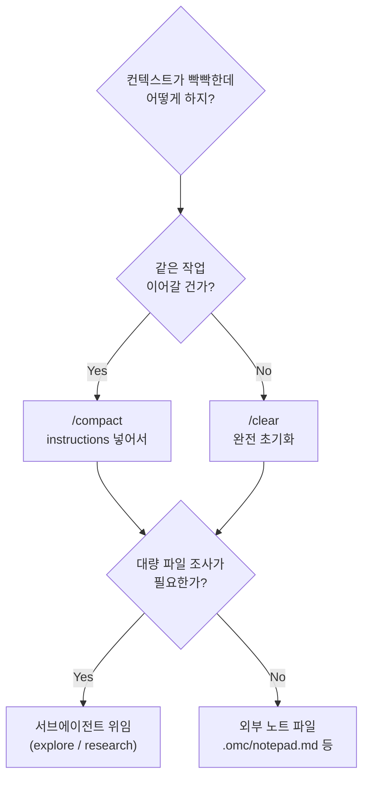

<Callout type="info">
"응답이 점점 멍청해지는데?" 하면 대부분 **컨텍스트가 한계 근처로 차 있는 것**이 원인입니다. 이 글은 그 상황을 **미리** 방지하는 세 가지 도구 — `/compact`, `CLAUDE.md`, auto-memory — 를 정확하게 이해하는 데 목적이 있어요.
</Callout>

## 0. 컨텍스트 위생의 세 층

Claude Code 의 컨텍스트 관리는 크게 세 층입니다.

1. **세션 안쪽** — `/compact`, `/clear`, `/context` 로 지금 이 대화의 토큰을 관리
2. **세션 바깥쪽 영속 레이어** — `CLAUDE.md` 계층, auto memory, `@import` 로 **모든 세션에 공통으로 실리는** 지침을 저장
3. **세션 간 상태 파일** — `.omc/notepad.md` 같은 "컨텍스트 밖" 노트로 중간 상태를 빼둠

이 세 층을 한 덩어리로 보지 말고 **따로** 이해하면, 어느 하나가 고장났을 때 어디를 손봐야 할지 명확해집니다.

## 1. `/compact` 의 정확한 메커니즘

### 1-1. 문법

```text
/compact [instructions]
```

- `[instructions]` 는 **선택 인자**. 생략하면 Claude 가 알아서 중요도를 판단해 요약합니다.
- 인자를 넣으면 **그 텍스트가 요약 방향을 지시**합니다. 이게 이 커맨드의 숨은 힘이에요.

### 1-2. 실제로는 3 층에서 동작한다

공식 문서와 커뮤니티 기술 분석([Decode Claude — Inside Claude Code's Compaction System](https://decodeclaude.com/compaction-deep-dive/)) 을 종합하면 컴팩션은 이렇게 나뉩니다.

1. **마이크로컴팩션 (microcompaction)** — Read, Bash, Grep, Glob, WebFetch 같은 툴 출력이 일정 크기를 넘으면 **디스크로 오프로드**되고, 컨텍스트엔 "최근 hot tail" 만 남습니다. 사용자가 `/compact` 를 치기 전부터 조용히 돌아가요.
2. **자동 컴팩션 (auto-compaction)** — 모델 출력 예비 공간과 컴팩션 워크플로 실행 공간을 뺀 여유가 특정 임계 아래로 떨어지면 시스템이 자동 트리거합니다. 공식 문서는 **정확한 % 를 공개하지 않아요.** (API 베타 `compact-2026-01-12` 는 기본 150,000 토큰 트리거)
3. **수동 컴팩션 `/compact`** — 사용자가 **자연스러운 작업 전환점**(기능 하나 끝, PR 만들기 직전 등) 에 직접 실행. `[instructions]` 로 우선순위를 지정.

### 1-3. 컴팩션에서 살아남는 것 vs 사라지는 것

공식 [Memory 문서 "What survives compaction"](https://code.claude.com/docs/en/memory) 섹션 기준.

| 살아남음 | 사라짐 |
|---|---|
| 프로젝트 루트 `CLAUDE.md` (디스크에서 재로드) | 대화 중에만 말한 지시 사항 |
| 태스크 리스트·플랜 상태 | 스킬 설명 목록 (호출된 스킬만 보존) |
| 훅 출력 | 자동 활성화됐던 path-scoped 규칙 (필요 시 재로드) |
| 최근 접근 파일 | verbose 한 툴 출력 |
| 요약 자체 | 탐색용으로 읽었다 버린 파일들 |

즉 **"대화 중에만 말한 지시"** 가 가장 쉽게 사라지는 카테고리예요. 반복될 지시라면 CLAUDE.md 에 넣는 게 정답.

### 1-4. `/compact` vs `/clear`

| | `/compact` | `/clear` (별칭 `/reset`, `/new`) |
|---|---|---|
| 대화 기록 | 요약으로 압축 | 완전 삭제 |
| 태스크·플랜 | 유지 | 초기화 |
| 파일 재로드 | 자동 | 없음 |
| 쓸 때 | 같은 작업 계속 | 완전히 다른 작업 시작 |

## 2. CLAUDE.md 계층 — 영속 지침 저장소

### 2-1. 6 개 레이어

[공식 Memory 문서](https://code.claude.com/docs/en/memory) 기준.

| 스코프 | 경로 | 공유 범위 |
|---|---|---|
| 관리 정책 | macOS: `/Library/Application Support/ClaudeCode/CLAUDE.md` | 조직 전체 (제외 불가) |
| 프로젝트 | `./CLAUDE.md` 또는 `./.claude/CLAUDE.md` | 팀 전체 (git 추적) |
| 개인 전역 | `~/.claude/CLAUDE.md` | 본인, 모든 프로젝트 |
| 개인 로컬 | `./CLAUDE.local.md` (`.gitignore` 권장) | 본인, 현재 프로젝트 |
| 서브디렉토리 | 하위 `CLAUDE.md` | 해당 디렉토리 파일 읽을 때 지연 로드 |
| 사용자 rules | `~/.claude/rules/` | 본인, 모든 프로젝트 |

로드 방식: 현재 작업 디렉토리에서 **위로 올라가며** `CLAUDE.md` + `CLAUDE.local.md` 를 모두 모아 컨텍스트에 붙입니다. 서브디렉토리 파일은 세션 시작 때가 아니라 **해당 디렉토리 파일을 읽는 순간** 지연 로드돼요.

### 2-2. `@` import 문법

```markdown
# 프로젝트 루트 CLAUDE.md
프로젝트 개요: @README.md
가능한 명령어: @package.json

## Git 워크플로
@docs/git-instructions.md

## 워크트리 간 공유되는 개인 설정
@~/.claude/my-project-preferences.md
```

- 상대 경로는 **import 하는 파일 기준**(작업 디렉토리 기준 아님)
- 재귀 최대 **5 단계**
- 외부 경로(`~` 이하 등) import 는 첫 사용 시 승인 다이얼로그

### 2-3. `/memory` 커맨드

현재 세션에서 로드된 모든 `CLAUDE.md`, `CLAUDE.local.md`, rules 파일 목록을 보여주고 auto memory 토글을 제공합니다. 파일을 선택하면 에디터에서 열려요. 자동 메모리가 조용히 불어나는지 주기적으로 이 커맨드로 점검하는 게 좋습니다.

### 2-4. Auto memory — Claude 가 스스로 쓰는 메모

- **요구 버전**: Claude Code v2.1.59 이상.
- **기본값**: 활성화.
- **저장 위치**: `~/.claude/projects/<project>/memory/` (git 레포 기준 공유).
- **구조**:

```text
~/.claude/projects/<project>/memory/
├── MEMORY.md          # 인덱스, 매 세션 로드
├── debugging.md       # 토픽별 파일 (필요 시 읽음)
├── api-conventions.md
└── ...
```

- `MEMORY.md` 로드 한도: **첫 200 줄 또는 25KB**, 먼저 도달하는 쪽.
- 토픽 파일들은 세션 시작 시 자동 로드되지 **않습니다** — Claude 가 필요할 때 툴로 직접 읽어요.
- Claude 가 **"미래에 유용할 것인가"** 를 스스로 판단해 저장합니다. 즉 조용히 커져요.
- 비활성화: `.claude/settings.json` 에 `"autoMemoryEnabled": false` 또는 환경변수 `CLAUDE_CODE_DISABLE_AUTO_MEMORY=1`.

### 2-5. CLAUDE.md 와 auto memory 는 역할이 다르다

| | `CLAUDE.md` | Auto memory |
|---|---|---|
| 작성자 | 사용자 | Claude |
| 내용 | 지시·규칙·아키텍처 | 학습한 패턴·명령어·선호도 |
| 스코프 | 프로젝트/개인/조직 | 워크트리 단위 |
| 로드 | 매 세션 전체 | `MEMORY.md` 첫 200 줄만 |
| 용도 | 코딩 표준·워크플로 | 발견된 팁·재사용 가능한 사실 |

## 3. 컨텍스트가 터지기 전 할 일들

### 3-1. `/context` 로 지금 얼마나 차 있는지부터

`/context` 는 색상 그리드로 현재 컨텍스트 사용률과 각 카테고리 비중을 보여줍니다. [공식 Context Window 문서](https://code.claude.com/docs/en/context-window) 기준 세션 시작 시 자동 로드되는 대표 항목들의 토큰 비용은:

- 시스템 프롬프트: ~4,200 토큰
- Auto memory (`MEMORY.md`): ~680 토큰
- 환경 정보: ~280 토큰
- MCP 툴 (지연 로드): ~120 토큰
- 스킬 설명 목록: ~450 토큰
- `~/.claude/CLAUDE.md`: ~320 토큰
- 프로젝트 `CLAUDE.md`: ~1,800 토큰

즉 말 한 번 하기도 전에 이미 수천 토큰이 먹혀 있어요. 프로젝트 `CLAUDE.md` 가 2,000 토큰 넘어가면 내부 `@import` 가 비대해졌을 가능성이 높습니다.

### 3-2. 전략적 선택: clear / compact / 서브에이전트



서브에이전트는 **빈 컨텍스트**로 시작해서 결과만 메인으로 돌려줍니다. 대량 파일 조사, 리뷰성 탐색은 서브에이전트로 밀면 메인 컨텍스트가 거의 안 줄어들어요.

## 4. 공식 문서에 잘 없는 팁

<Callout type="warn" title="60% 룰 — /compact 는 80% 에서 치지 말고 60% 에서 쳐라">
공식 문서는 컴팩션 타이밍을 명시하지 않습니다. 커뮤니티에서 검증된 패턴은 **컨텍스트가 60% 찼을 때** `/compact` 를 치는 것. 80–95% 까지 미루면 Claude 가 이미 열화된 정보로 요약을 만들게 돼요(Claude 의 출력 품질 자체가 떨어진 상태에서 요약됨). `/context` 로 시각화한 뒤 기능 하나 끝나는 자연스러운 경계에서 실행하는 게 이상적. 출처: [MindStudio — /compact command guide](https://www.mindstudio.ai/blog/claude-code-compact-command-context-management).
</Callout>

<Callout type="warn" title="컴팩션 직후 검증 프롬프트로 드롭 방지">
컴팩션이 끝나면 곧바로 다음 한 줄을 치세요.

```text
지금 우리가 어디까지 왔고 다음에 뭘 할 예정인지 한 번 요약해줘.
```

요약이 엇나갔다면 이 시점에 교정 가능합니다. 이 확인 없이 그냥 작업을 이어가면 **드롭된 컨텍스트를 한참 뒤에 발견**하게 돼요. 출처: [Steve Kinney — Claude Code Compaction](https://stevekinney.com/courses/ai-development/claude-code-compaction).
</Callout>

<Callout type="warn" title="Auto memory 는 조용히 커진다 — /memory 로 주기 점검 필수">
Auto memory 는 Claude 가 자동으로 씁니다. 그래서 `MEMORY.md` 가 200 줄/25KB 를 넘어가면 **초과분은 세션 시작 시 로드되지 않아요.** 즉 어느 시점부터 "예전에 학습된 것이 갑자기 적용 안 되는" 현상이 생깁니다. `/memory` 커맨드로 주기적으로 열어보고, 토픽 파일을 마크다운으로 직접 편집·삭제해서 가지치기하세요. 이건 공식 Memory 문서에도 언급은 되지만 실전에서 얼마나 중요한지는 거의 안 강조됩니다.
</Callout>

<Callout type="warn" title="@import 는 5 단계까지 재귀 — 대형 README 에 주의">
`@path` import 는 최대 5 단계까지 재귀합니다. `CLAUDE.md` 가 `AGENTS.md` 를 import 하고, `AGENTS.md` 가 다시 `docs/architecture.md` 를 import 하면 첫 세션 로드부터 많은 토큰이 소비돼요. 특히 대형 `README.md` 나 `package.json` 을 `@` 로 걸면 컨텍스트 초기 비용이 예상보다 훨씬 큽니다. `/context` 로 프로젝트 `CLAUDE.md` 토큰 비중을 확인해서 1,500 토큰을 넘으면 import 구조를 가지치기하세요.
</Callout>

## 5. 실전 예시

### 예시 A. 인자 없는 `/compact` vs 인자 있는 `/compact`

```text
# 일반적인 경우 (Claude 가 알아서 판단)
/compact

# 구체적으로 유지 대상 명시
/compact preserve: 현재 파일 경로들, PostgreSQL 선택 이유,
리팩터링 필요한 세 함수 목록, auth.ts 의 현재 에러 메시지

# 영어 혼용 (종종 더 정확하게 먹힙니다)
/compact preserve all file paths, the auth middleware changes,
current test failures in auth.spec.ts, and the decision to use JWT refresh tokens
```

### 예시 B. 프로젝트 루트 `CLAUDE.md` 의 기본 뼈대

```markdown
# 프로젝트 이름

## 프로젝트 목적
... 한 문단 ...

## 커밋 컨벤션
@docs/commit-convention.md

## 아키텍처 요약
@docs/architecture.md

## Claude Code 용 지시
- billing 관련 변경은 항상 plan 모드에서 시작할 것
- 테스트 없는 커밋 금지
- 개인 설정: @~/.claude/my-project-preferences.md
```

핵심은 **지시(instructions)** 와 **참고 자료(imports)** 를 섹션 단위로 분리하는 것. Claude 가 스캔할 때 "어디를 읽어야 하는지" 가 명확해집니다.

### 예시 C. Auto memory 끄고 수동으로 `CLAUDE.local.md` 관리

```json
// .claude/settings.json
{
  "autoMemoryEnabled": false
}
```

```markdown
<!-- CLAUDE.local.md (.gitignore 에 추가) -->
# 로컬 전용 컨텍스트

## 개인 빌드 명령
- 테스트만: `pnpm test:unit --watch`
- 풀 빌드: `pnpm build && pnpm lint && pnpm test`

## 현재 집중 중인 이슈
- auth 토큰 갱신 타이밍 버그 (#142)
```

Auto memory 가 싫은 사람(내가 모르는 학습이 조용히 쌓이는 게 불편) 은 이 조합이 깔끔합니다.

### 예시 D. 외부 노트로 컴팩션 저항력 만들기

```markdown
<!-- .omc/notepad.md (컨텍스트 밖 보관) -->
## 현재 작업 상태
- 구현 중: auth 토큰 갱신 로직 (src/auth/refresh.ts)
- 완료: DB 스키마 변경 (migration 042)
- 다음: refresh 엔드포인트 통합 테스트 추가

## 기억해야 할 결정
- JWT 만료 15 분, refresh 7 일
- Redis 세션 키 포맷: `session:{userId}:{deviceId}`
```

컴팩션 후에도 이 파일은 디스크에 남아 있으므로 `@.omc/notepad.md` 로 언제든 재참조할 수 있어요. OMC 는 이 파일을 컨텍스트 위생의 핵심 도구로 취급합니다.

## 6. 다음에 읽을 글

- [Claude Code 네이티브 슬래시 커맨드 카탈로그](/docs/02-slash-commands/claude-code-catalog) — `/compact`, `/clear`, `/context`, `/memory` 가 속한 전체 커맨드 지도
- [OMC 슬래시 커맨드 카탈로그](/docs/02-slash-commands/omc-catalog) — OMC 의 notepad·state 파일이 컴팩션 저항성을 어떻게 만드는지

## 참고 자료 (Primary sources)

**공식 문서**
- [Claude Code — Memory](https://code.claude.com/docs/en/memory) — `CLAUDE.md` 계층·auto memory·`@import`·컴팩션 생존 항목
- [Claude Code — Commands](https://code.claude.com/docs/en/commands) — `/compact`, `/clear`, `/context`, `/memory` 정확 문법
- [Claude Code — Context Window](https://code.claude.com/docs/en/context-window) — 각 항목별 토큰 비용 시뮬레이터
- [Claude API — Compaction](https://platform.claude.com/docs/en/build-with-claude/compaction) — API 레벨 `compact-2026-01-12` 베타 헤더·트리거 파라미터

**커뮤니티 검증 (보조)**
- [Decode Claude — Inside Claude Code's Compaction System](https://decodeclaude.com/compaction-deep-dive/) — 마이크로컴팩션 3 단계·복원 순서 기술 분석
- [MindStudio — /compact command guide](https://www.mindstudio.ai/blog/claude-code-compact-command-context-management) — 60% 룰·4 카테고리 보존 프레임워크
- [Steve Kinney — Claude Code Compaction](https://stevekinney.com/courses/ai-development/claude-code-compaction) — 태스크 경계 수동 컴팩션 패턴

---

<Callout type="info">
**Last verified: 2026-04-11** — Claude Code v2.1.x 기준. Auto memory 는 v2.1.59 이상에서만 동작. 공식 문서 도메인은 `code.claude.com/docs/en/*` 로 이전됐습니다(`docs.anthropic.com/en/docs/claude-code/*` 는 301 리다이렉트).
</Callout>
