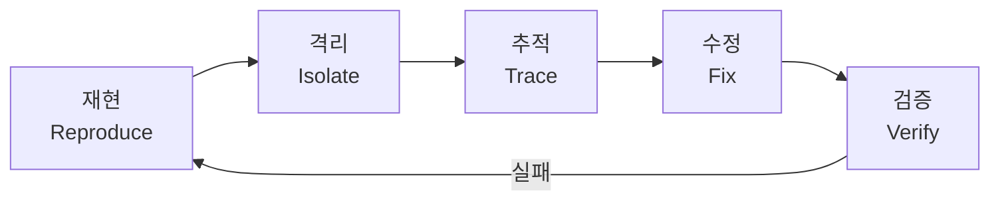

<Callout type="info">
Claude Code 에게 "이 버그 고쳐줘" 라고 하면 증상만 감추는 패치가 나옵니다. **재현 → 격리 → 추적 → 수정 → 검증** 루프를 따르면 근본 원인을 잡을 수 있어요.
</Callout>

## 5단계 디버깅 루프



## 1. 재현 — 실패하는 테스트부터

[공식 Best Practices](https://code.claude.com/docs/en/best-practices) 가 제시하는 디버깅 프롬프트의 정석:

```
로그인이 세션 타임아웃 후 실패함.
src/auth/ 의 토큰 리프레시 로직을 확인해줘.
재현하는 테스트를 먼저 작성하고, 그 다음에 수정해.
```

핵심은 **증상 + 위치 + 재현 방법 + 성공 기준** 네 가지를 한 프롬프트에 담는 것:

| 요소 | 약한 예 | 강한 예 |
|---|---|---|
| 증상 | "로그인 버그" | "세션 타임아웃 후 로그인 실패" |
| 위치 | (없음) | "src/auth/, 특히 토큰 리프레시" |
| 재현 | (없음) | "재현 테스트 먼저 작성" |
| 기준 | (없음) | "테스트 통과 확인" |

에러 로그가 있으면 파이프로 바로 넘기세요:

```bash
cat build-error.txt | claude -p "이 에러의 근본 원인을 분석해줘"
```

## 2. 격리 — Plan 모드로 읽기만

수정하기 전에 구조를 파악하는 게 먼저입니다. Plan 모드에서 코드를 읽기만 하세요:

```
이 에러의 콜 체인을 추적해줘. 수정은 하지 마.
에러가 발생하는 파일, 함수, 조건을 정리해줘.
```

[공식 문서](https://code.claude.com/docs/en/best-practices)의 4단계 워크플로 — 탐색 → 설계 → 구현 → 커밋 — 에서 탐색과 설계가 여기에 해당해요.

<Callout type="warn" title="타입 에러의 함정">
TypeScript 타입 에러는 에러가 표시되는 파일이 원인이 아닌 경우가 많습니다. 타입의 변환 경로를 처음부터 끝까지 추적해야 실제 불일치 지점을 찾을 수 있어요. "이 파일을 고쳐줘" 대신 "이 타입의 변환 경로를 추적해줘" 가 더 효과적입니다.
</Callout>

## 3. 병렬 에이전트로 가설 검증

복잡한 버그는 원인이 하나가 아닐 수 있습니다. [Agent Teams](https://code.claude.com/docs/en/agent-teams) 를 쓰면 여러 가설을 **동시에** 검증할 수 있어요:

```
앱이 메시지 하나 보내고 연결이 끊긴다는 제보가 있어.
팀메이트 5명을 만들어서 각각 다른 가설을 조사하게 해줘.
서로 상대 가설을 반박하면서 과학적 토론처럼 진행하고,
합의된 결론을 findings.md 에 정리해.
```

이 패턴은 [공식 Agent Teams 문서](https://code.claude.com/docs/en/agent-teams)에 "competing hypotheses" 사용 사례로 제시돼 있습니다.

[실전 사례](https://magarcia.io/using-claude-code-agent-teams-for-incident-investigation/)에서는 4명의 병렬 에이전트가 각각 인프라 메트릭, 에러 트래킹, 최근 배포 코드 변경, Slack 인시던트 채널을 조사해서 10분 만에 장애 원인을 찾았어요. 수동으로는 30~45분 걸리는 작업이었습니다.

Agent Teams 를 활성화하려면:

```json
{
  "env": {
    "CLAUDE_CODE_EXPERIMENTAL_AGENT_TEAMS": "1"
  }
}
```

단일 에이전트로 충분한 경우에는 [subagent](https://code.claude.com/docs/en/sub-agents) 가 더 가볍습니다:

```
subagent 를 써서 인증 시스템의 토큰 리프레시 로직을 조사해줘.
메인 컨텍스트를 오염시키지 않게 별도로 탐색하고 결과만 보고해.
```

<Callout type="warn" title="Agent Teams 제약사항">
Agent Teams 는 실험적 기능입니다. 세션 재개 시 진행 중인 팀메이트는 복원되지 않고, 중첩 팀(팀 안의 팀)은 지원되지 않아요. 토큰 비용은 팀메이트 수에 비례해서 증가합니다.
</Callout>

## 4. git bisect — 언제 깨졌는지 찾기

"어느 커밋에서 깨졌지?" 는 `git bisect` + Claude Code 로 자동화할 수 있습니다:

```bash
# 1. bisect 시작
git bisect start
git bisect bad HEAD
git bisect good v1.2.0

# 2. 자동 테스트로 bisect 실행
git bisect run npm test

# 3. 결과를 Claude 에게 분석 요청
git bisect log | claude -p "이 bisect 로그를 분석해줘. \
어떤 커밋이 회귀를 도입했고, 변경 내용이 뭘 시사하는지 설명해."

# 4. 정리
git bisect reset
```

100개 커밋에서 7번의 테스트로 원인 커밋을 찾을 수 있어요 (log2 검색).

## 5. 검증 — 수정 후 회귀 확인

수정이 끝나면 반드시 전체 테스트를 돌리세요:

```
수정 완료했으면 테스트 스위트 전체를 실행하고,
실패하는 테스트가 있으면 이번 수정이 원인인지 확인해.
이번 수정과 무관한 기존 실패라면 그것도 알려줘.
```

[공식 문서](https://code.claude.com/docs/en/best-practices)의 핵심 원칙: **"Claude 에게 작업을 검증할 방법을 주세요."** 디버깅에서 이건 "테스트를 돌려서 통과하는지 확인해" 입니다.

## 다음에 읽을 글

- [바이브코딩 파이프라인](/docs/04-workflows/vibe-coding-pipeline) — 디버깅을 넘어 전체 개발 워크플로
- [프롬프트 단축어와 패턴](/docs/07-tips-tricks/prompt-shortcuts) — 디버깅 프롬프트 외의 효과적인 패턴들

## 참고 자료

- [Claude Code — Best Practices](https://code.claude.com/docs/en/best-practices) — 디버깅 프롬프트 패턴, 검증 원칙
- [Claude Code — Agent Teams](https://code.claude.com/docs/en/agent-teams) — 병렬 가설 검증 패턴
- [Claude Code — Sub-agents](https://code.claude.com/docs/en/sub-agents) — 격리된 조사 에이전트
- [Incident Investigation with Agent Teams](https://magarcia.io/using-claude-code-agent-teams-for-incident-investigation/) — 실전 장애 대응 사례
- [Debugging Workflows](https://developertoolkit.ai/en/claude-code/productivity-patterns/debugging-workflows/) — git bisect + Claude 파이프라인

---

<Callout type="info">
**Last verified: 2026-04-15** — Claude Code v2.1.109 기준. Agent Teams 는 실험적 기능.
</Callout>
