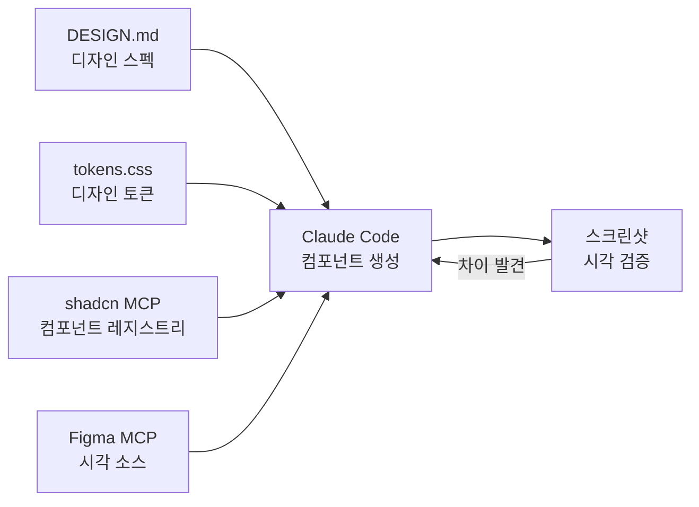

<Callout type="info">
AI 에이전트에게 "예쁘게 만들어줘" 라고 하면 매번 다른 결과가 나옵니다. **디자인 시스템을 파일로 정의**하면, 에이전트가 매번 같은 기준으로 UI 를 생성해요. 이 챕터는 그 파이프라인을 만드는 법입니다.
</Callout>

## 파이프라인 전체 흐름



## 1. DESIGN.md — 디자인 시스템을 텍스트로

[DESIGN.md](https://github.com/VoltAgent/awesome-design-md) 는 브랜드의 색상, 타이포그래피, 컴포넌트 규칙을 마크다운으로 기술한 파일입니다. AI 에이전트가 세션 시작 시 읽어서 일관된 UI 를 생성하는 데 쓰여요.

```markdown
# DESIGN.md

## Color Palette
- `--color-primary: #0F172A` — 본문, 주요 UI
- `--color-accent: #6366F1` — 인터랙티브 요소, CTA

## Typography
- Headings: Inter 700, 1.2 line-height
- Body: Inter 400, 16px, 1.6 line-height

## Components
- Buttons: solid fill, 8px radius, no shadow
- Cards: 1px border, subtle hover lift

## Agent Prompt Guide
> "DESIGN.md 의 색상과 타이포그래피를 정확히 따라 구현하세요."
```

[awesome-design-md](https://github.com/VoltAgent/awesome-design-md) 에 Vercel, Stripe, Linear 등 60개 이상의 실제 브랜드 DESIGN.md 가 있으니 참고하세요.

CLAUDE.md 에서 import 하면 매 세션마다 자동 로드됩니다:

```markdown
# CLAUDE.md
@DESIGN.md
```

## 2. Figma MCP — 디자인 원본 연결

[Figma 공식 MCP 서버](https://help.figma.com/hc/en-us/articles/32132100833559-Guide-to-the-Figma-MCP-server)를 연결하면 Claude Code 가 Figma 파일을 직접 읽을 수 있습니다:

```bash
claude mcp add --transport http figma https://mcp.figma.com/mcp
```

연결 후 `/mcp` 에서 figma 를 선택하고 인증하면 끝이에요.

제공되는 주요 기능:

- Figma 프레임을 읽어서 코드 생성 (`generate_figma_design`)
- 디자인 변수와 토큰 규칙 추출 (`get_variable_defs`, `create_design_system_rules`)
- Code Connect 매핑으로 생성 코드와 실제 컴포넌트 연결 (`get_code_connect_map`)

<Callout type="warn" title="Figma MCP 무료 제한">
캔버스 쓰기 기능은 리모트 서버에서만 동작하고, 현재 무료 베타 중이지만 향후 사용량 기반 요금제가 도입될 예정입니다. 실무용이라면 Professional 이상 + Dev/Full seat 을 권장해요.
</Callout>

## 3. shadcn/ui MCP — 컴포넌트 레지스트리 연결

[shadcn/ui](https://ui.shadcn.com/docs) 는 AI 협업을 위해 설계된 컴포넌트 라이브러리입니다. 공식 [MCP 서버](https://ui.shadcn.com/docs/mcp)를 연결하면 Claude Code 가 최신 컴포넌트 API 를 실시간으로 참조해요:

```bash
pnpm dlx shadcn@latest mcp init --client claude
```

이 명령은 `.claude/settings.json` 에 로컬 stdio MCP 서버를 등록합니다. 서버가 제공하는 것:

- 컴포넌트 레지스트리 실시간 접근 (학습 데이터 기반이 아닌 최신 API)
- TypeScript prop 정의
- 자연어 설치: "이메일과 비밀번호 필드가 있는 로그인 폼 추가해줘"

shadcn/ui 의 [Skills 문서](https://ui.shadcn.com/docs/skills)에서 Claude Code 전용 Skill 도 제공합니다. `shadcn info --json` 명령으로 설치된 컴포넌트, 프레임워크, Tailwind 버전을 파악해요 (shadcn CLI 필요).

## 4. 생성 + 검증 루프

모든 컨텍스트를 연결했으면, 실제 컴포넌트 생성은 이렇게 돌아갑니다:

```
DESIGN.md 의 색상과 spacing 을 따라서 pricing card 를 만들어줘.
shadcn Card 컴포넌트를 기반으로 하고, 3개 티어 구조로.
완성되면 Playwright MCP 로 dev 서버 띄워서 스크린샷 찍고,
DESIGN.md 와 비교해서 차이가 있으면 수정해.
```

[공식 Best Practices](https://code.claude.com/docs/en/best-practices) 가 강조하는 핵심: **"Claude 에게 작업을 검증할 방법을 주세요. 이것이 가장 레버리지가 큰 한 가지입니다."** 시각 검증이 그 방법이에요.

### Playwright MCP — 자동 시각 검증

[Microsoft 공식 Playwright MCP](https://github.com/microsoft/playwright-mcp) 를 연결하면 Claude 가 직접 브라우저를 띄우고 스크린샷을 찍어서 비교할 수 있습니다:

```bash
claude mcp add playwright npx '@playwright/mcp@latest'
```

연결되면 Claude 가 자동으로:

- `playwright_navigate` 로 dev 서버 페이지 열기
- `playwright_screenshot` 으로 컴포넌트 캡처
- 캡처 이미지를 자기 컨텍스트에 로드해서 DESIGN.md 와 직접 비교
- 차이 발견 시 코드 수정 → 다시 캡처 → 재비교

사람이 매번 스크린샷 찍어서 보여줄 필요가 없어요. 검증 루프가 완전히 닫힙니다.

<Callout type="warn" title="DOM 스냅샷 우선">
Playwright MCP 의 기본 모드는 **accessibility tree (DOM 스냅샷)** 를 반환합니다. 시각 비교가 정말 필요한 경우에만 `--vision` 또는 `playwright_screenshot` 을 명시적으로 호출하세요. DOM 스냅샷이 토큰 효율이 훨씬 좋고, 텍스트 콘텐츠 검증은 그걸로 충분해요.
</Callout>

### 프론트엔드 미학 Skill

[Anthropic 블로그](https://claude.com/blog/improving-frontend-design-through-skills)에서 공개한 프론트엔드 미학 Skill 패턴:

```markdown
# .claude/skills/frontend-aesthetics/SKILL.md
---
name: frontend-aesthetics
description: UI 생성 시 미학 기준 적용
---

Typography: system fonts 대신 Fraunces, Satoshi, JetBrains Mono
Color: CSS 변수 기반 팔레트, 선명한 액센트 컬러
Motion: CSS-only 애니메이션, 로딩 시퀀스 강조
Backgrounds: 레이어드 그라디언트, 맥락적 깊이감 — 흰 배경 금지
```

이 Skill 을 활성화하면 Claude 가 UI 를 생성할 때 자동으로 미학 기준을 적용합니다.

<Callout type="warn" title="Writer/Reviewer 분리 패턴">
같은 세션에서 생성과 검수를 하면 자기 코드에 관대해지기 쉽습니다. 세션 A 에서 컴포넌트를 생성하고, 세션 B 에서 DESIGN.md 대비 시각 검수를 하면 더 정확해요. [하네스 엔지니어링](/docs/00-start/harness-engineering) 에서 말한 "검증은 별도 패스로" 원칙입니다.
</Callout>

## 다음에 읽을 글

- [바이브코딩 파이프라인](/docs/04-workflows/vibe-coding-pipeline) — 디자인을 넘어 전체 개발 파이프라인
- [실전 CLAUDE.md 패턴](/docs/07-tips-tricks/claude-md-patterns) — DESIGN.md 를 CLAUDE.md 에 통합하는 @ 경로 참조

## 참고 자료

- [awesome-design-md](https://github.com/VoltAgent/awesome-design-md) — 60+ 브랜드 DESIGN.md 모음
- [Figma MCP Server Guide](https://help.figma.com/hc/en-us/articles/32132100833559-Guide-to-the-Figma-MCP-server) — Figma 공식 MCP 가이드
- [shadcn/ui MCP Server](https://ui.shadcn.com/docs/mcp) — shadcn 공식 MCP 문서
- [shadcn/ui Skills](https://ui.shadcn.com/docs/skills) — Claude Code 전용 Skill
- [Improving frontend design through Skills](https://claude.com/blog/improving-frontend-design-through-skills) — Anthropic 프론트엔드 미학 스킬
- [Microsoft Playwright MCP](https://github.com/microsoft/playwright-mcp) — 자동 브라우저 + 스크린샷 검증
- [Claude Code — Best Practices](https://code.claude.com/docs/en/best-practices) — 시각 검증 패턴

---

<Callout type="info">
**Last verified: 2026-04-15** — Claude Code v2.1.109, Figma MCP 리모트 서버 무료 베타, shadcn CLI 3.0 기준.
</Callout>
