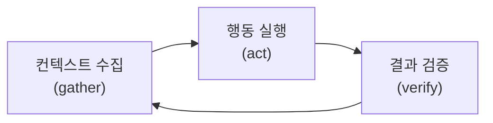
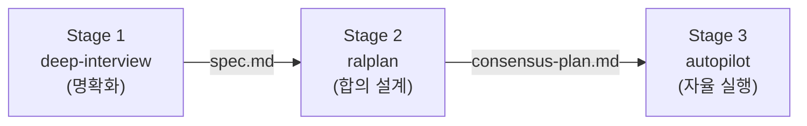

<Callout type="info">
"바이브코딩"은 Andrej Karpathy 가 2025년 2월에 만든 말입니다. **"코드가 존재한다는 사실 자체를 잊고, 분위기(vibe)에 몸을 맡긴다."** 이 챕터는 그 감각을 유지하면서도 **결과물이 프로덕션에 갈 수 있는** 구조를 다룹니다.
</Callout>

## 1. 바이브코딩이란

Karpathy 의 원문은 이렇습니다.

> "There's a new kind of coding I call 'vibe coding', where you fully give in to the vibes, embrace exponentials, and forget that the code even exists."
> — [Andrej Karpathy, 2025-02](https://x.com/karpathy/status/1886192184808149383)

키보드를 거의 안 치고, 말로 지시하고, diff 를 안 읽고, 에러가 나면 에러 메시지를 그대로 붙여넣는 — 그런 방식이에요. 주말 프로젝트에는 잘 먹히지만, 규모가 커지면 문제가 생깁니다. CodeRabbit 의 [분석](https://www.coderabbit.ai/blog/a-semantic-history-how-the-term-vibe-coding-went-from-a-tweet-to-prod)에 따르면, 2026년 초 Karpathy 본인도 **"agentic engineering"** 이라는 후속 용어를 제안했어요. 바이브코딩의 감각은 유지하되, 검증·파이프라인·하네스를 갖추자는 뜻입니다.

이 챕터가 다루는 게 정확히 그 지점 — **바이브코딩 감각 + 구조화된 파이프라인**입니다.

## 2. 기반: Claude Code 의 에이전틱 루프

모든 파이프라인의 바닥에는 Claude Code 의 실행 루프가 있습니다. [공식 문서](https://code.claude.com/docs/en/how-claude-code-works)가 설명하는 세 단계:



- **Gather** — 파일 읽기, grep, git log 등으로 현재 상태 파악
- **Act** — 코드 수정, 파일 생성, Bash 실행
- **Verify** — 테스트 실행, 빌드 확인, 결과 비교

이 루프가 도는 한 Claude Code 는 계속 일합니다. 한 턴에 수십 개 tool call 을 체이닝할 수 있어요. 퓨어 사용자는 이 루프를 **수동으로** 돌립니다 — 매번 "이거 해줘" → 확인 → "다음 이거". [하네스 엔지니어링](/docs/00-start/harness-engineering)에서 설명한 것처럼, workflow harness 를 올리면 이 수동 루프가 자동화됩니다.

## 3. OMC 3단계 파이프라인

[OMC](https://github.com/Yeachan-Heo/oh-my-claudecode)는 Claude Code 위에 워크플로 하네스를 얹은 오케스트레이션 레이어입니다. 아이디어를 코드로 만드는 전체 흐름을 **세 단계**로 나눕니다.



### Stage 1 — deep-interview: "뭘 만들지 확실히 하기"

```bash
# 터미널에서 바로 시작
claude
> 로그인 대시보드를 만들고 싶어. deep interview
```

OMC 가 Socratic Q&A 를 시작합니다. 목표 명확도·제약 조건·성공 기준을 **수치로 채점**하면서 모호도가 임계값(기본 20%) 이하로 떨어질 때까지 질문을 반복해요. 끝나면 `.omc/specs/` 에 크리스털화된 스펙이 저장됩니다.

<Callout type="warn" title="명확화의 ROI">
deep-interview 에 10분 쓰면 autopilot 에서 30분 삽질을 줄일 수 있어요. 공식 문서 어디에도 이 공식은 없지만, 실전에서 반복 확인된 패턴입니다. 요구사항이 모호할수록 에이전트가 엉뚱한 방향으로 달리는 시간이 길어지거든요.
</Callout>

### Stage 2 — ralplan: "어떻게 만들지 합의하기"

```bash
> ralplan
```

Planner · Architect · Critic 세 에이전트가 구현 전략을 돌아가며 검토합니다. 한 에이전트가 플랜을 세우면 다른 에이전트가 반박하고, 합의될 때까지 반복해요. 결과물은 `.omc/plans/` 에 저장되는 consensus plan 입니다.

### Stage 3 — autopilot: "만들고 검증까지"

```bash
> autopilot
```

Lead 에이전트가 전체 실행을 조율합니다. 설계된 플랜을 받아서 executor subagent 에게 구현을 위임하고, test-engineer 가 테스트를 붙이고, code-reviewer 가 검수합니다. 빌드·테스트 통과까지 **알아서 반복**해요.

## 4. 실전: 전체 흐름 예시

주말 프로젝트로 **할 일 관리 웹앱**을 만든다고 해볼게요.

```bash
# 1. 아이디어 → 스펙
claude
> 할 일 관리 웹앱을 만들고 싶어. Next.js + Supabase. deep interview
# (5~10분 Q&A 후 spec 생성)

# 2. 스펙 → 플랜
> ralplan
# (Planner/Architect/Critic 합의 → consensus-plan.md)

# 3. 플랜 → 동작하는 코드
> autopilot
# (executor가 코드 작성, test-engineer가 테스트, reviewer가 검수)
# 끝나면 빌드 통과 + 커밋 완료 상태
```

세 단계를 다 밟아도 30분~1시간이면 MVP 가 나옵니다. 각 단계는 독립적이라서 Stage 2 를 건너뛰고 `deep-interview → autopilot` 으로 가거나, 이미 플랜이 있으면 `autopilot` 만 돌릴 수도 있어요.

<Callout type="warn" title="단계 생략의 대가">
Anthropic 의 [하네스 설계 가이드](https://www.anthropic.com/engineering/effective-harnesses-for-long-running-agents)는 "진행 상황을 보고 완료됐다고 선언하는" 에이전트 패턴을 주요 실패 유형 중 하나로 꼽습니다. Stage 1(명확화)이나 Stage 2(합의)를 건너뛰면 이 패턴에 빠질 확률이 높아져요. 시간이 아까워도 3단계를 다 밟는 게 결과적으로 빠릅니다.
</Callout>

## 5. 왜 이 구조인가

Anthropic 이 [에이전트 설계 가이드](https://www.anthropic.com/research/building-effective-agents)에서 제시한 핵심 원칙:

> "Maintain simplicity in your agent's design."

OMC 의 3단계는 이 원칙을 따릅니다. 각 단계가 하나의 책임만 지고, 단계 사이의 인터페이스는 파일(spec.md, plan.md) 하나예요. 그리고 [컨텍스트 엔지니어링](https://www.anthropic.com/engineering/effective-context-engineering-for-ai-agents)에서 설명하는 전략 — compaction, structured note-taking, sub-agent 아키텍처 — 이 세 단계 분리의 기술적 근거이기도 합니다. 한 세션에 모든 걸 다 하면 컨텍스트가 터지거든요. 단계를 나누면 각 단계가 깨끗한 컨텍스트로 시작할 수 있습니다.

## 다음에 읽을 글

- [Slash Commands — OMC 카탈로그](/docs/02-slash-commands/omc-catalog) — deep-interview, ralplan, autopilot 각 커맨드의 상세 레퍼런스
- [Session & Context — Compact 활용법](/docs/03-session-context/compact-and-memory) — 파이프라인 중간에 컨텍스트가 부족해졌을 때 대처법

## 참고 자료

- [Andrej Karpathy — "Vibe Coding" 원문](https://x.com/karpathy/status/1886192184808149383) — 2025-02
- [Claude Code — How Claude Code Works](https://code.claude.com/docs/en/how-claude-code-works) — 에이전틱 루프 공식 설명
- [Anthropic — Building Effective Agents](https://www.anthropic.com/research/building-effective-agents) — 에이전트 설계 원칙, 2024-12
- [Anthropic — Effective Harnesses for Long-Running Agents](https://www.anthropic.com/engineering/effective-harnesses-for-long-running-agents) — 장기 실행 하네스 설계, 2025-11
- [Anthropic — Effective Context Engineering](https://www.anthropic.com/engineering/effective-context-engineering-for-ai-agents) — 컨텍스트 엔지니어링 전략, 2025-09
- [oh-my-claudecode GitHub](https://github.com/Yeachan-Heo/oh-my-claudecode) — OMC 공식 레포
- [CodeRabbit — A Semantic History of Vibe Coding](https://www.coderabbit.ai/blog/a-semantic-history-how-the-term-vibe-coding-went-from-a-tweet-to-prod) — 용어 진화 분석, 2026-03

---

<Callout type="info">
**Last verified: 2026-04-15** — Claude Code v2.1.109 / OMC v4.11.6 기준.
</Callout>
