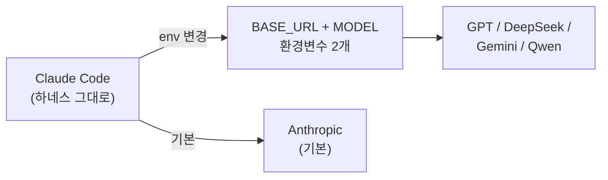

<Callout type="info">
Claude Code 가 비싸다고 느끼는 순간이 옵니다. 그런데 Claude Code 의 진짜 가치는 모델이 아니라 **하네스** — 실행 루프, 툴 디스패치, 컨텍스트 관리 — 에 있어요. 모델만 GPT 로 바꿔도 그 하네스는 그대로 동작합니다.
</Callout>

## 핵심 아이디어

[하네스 엔지니어링](/docs/00-start/harness-engineering) 에서 설명한 것처럼, Claude Code 는 **runtime harness** 입니다. 모델은 교체 가능한 부품이에요. `ANTHROPIC_BASE_URL` 과 `ANTHROPIC_MODEL` 환경변수 두 개면 Claude Code 가 바라보는 백엔드를 통째로 바꿀 수 있습니다.



즉, **터미널 두 개를 띄워서 하나는 Opus, 하나는 GPT 로 돌리는 것**도 됩니다. Claude Code 의 설정·CLAUDE.md·Hooks·Skills 는 전부 그대로 유지되고, 뒤에서 돌아가는 모델만 다른 거예요.

## vibeProxy — 3분이면 끝나는 가장 쉬운 방법

[vibeProxy](https://github.com/automazeio/vibeproxy) 는 macOS 메뉴바 앱입니다. 이미 가지고 있는 **ChatGPT Pro / Claude Max 구독을 다른 AI 툴에서 재활용**할 수 있게 해줘요. API 키 없이 OAuth 로그인만 하면 됩니다.

### 세팅 (3분)

1. [vibeProxy 설치](https://github.com/automazeio/vibeproxy) — `/Applications` 에 앱 넣기
2. 앱 실행 → OpenAI (또는 다른 서비스) 구독 로그인
3. 터미널에서:

```bash
ANTHROPIC_BASE_URL=http://localhost:8318 \
ANTHROPIC_MODEL=gpt-5.4 claude
```

이게 전부. 하네스 기능(Hooks, subagent 위임, CLAUDE.md 규칙)은 그대로 동작합니다. 단, Claude Code 는 모델 ID 서브스트링 매칭으로 기능을 감지하기 때문에 GPT 모델 ID 를 쓰면 **extended thinking, 64K 출력 등 Claude 전용 기능은 비활성화**됩니다.

<Callout type="warn" title="macOS 전용, 그리고 tool calling 호환성">
vibeProxy 는 **macOS 에서만** 동작합니다. 그리고 모든 모델이 Claude Code 와 100% 호환되는 건 아니에요. Claude Code 는 내부적으로 **tool calling** 을 대량으로 쓰는데 (파일 수정, Bash 실행, git 조작 등), 일부 모델은 긴 세션에서 tool call 대신 plain text 로 응답하기 시작합니다. GPT 계열은 대체로 안정적이고, DeepSeek 계열은 별도 설정(`tooluse` transformer) 이 필요할 수 있어요.
</Callout>

## 더 세밀하게 제어하고 싶다면

vibeProxy 는 "구독 재활용 + GUI" 에 초점이 맞춰져 있어서, 역할별 라우팅(복잡한 건 Opus, 단순한 건 DeepSeek) 같은 건 안 돼요. 그런 게 필요하면:

| 도구 | 특징 | 링크 |
|---|---|---|
| **claude-code-router** | 역할별 JSON 라우팅 (`default` / `background` / `think` 등), 크로스플랫폼 | [GitHub](https://github.com/musistudio/claude-code-router) |
| **OpenRouter 직접** | 환경변수 3줄이면 끝. 가장 단순한 대안 | [가이드](https://openrouter.ai/docs/guides/coding-agents/claude-code-integration) |
| **LiteLLM Proxy** | 팀·조직용 중앙화. 자동 fallback + 로깅 | [GitHub](https://github.com/BerriAI/litellm) |

OpenRouter 로 모델을 바꾸는 가장 단순한 예시:

```bash
export OPENROUTER_API_KEY="sk-or-v1-xxxxxxxxxxxx"
export ANTHROPIC_BASE_URL="https://openrouter.ai/api"
export ANTHROPIC_AUTH_TOKEN="$OPENROUTER_API_KEY"
export ANTHROPIC_API_KEY=""   # 반드시 비워야 함

claude
```

<Callout type="warn" title="공식 문서엔 간접적으로만 있는 환경변수 트릭">
Claude Code 가 내부적으로 Opus / Sonnet / Haiku 를 자동 선택하는 걸 **환경변수로 덮어쓸 수 있습니다.** `ANTHROPIC_DEFAULT_OPUS_MODEL`, `ANTHROPIC_DEFAULT_SONNET_MODEL`, `ANTHROPIC_DEFAULT_HAIKU_MODEL`, `CLAUDE_CODE_SUBAGENT_MODEL` — 이 네 개를 세팅하면 "복잡한 추론만 비싼 모델, 나머지는 저가 모델" 구조가 완성돼요. 명시적 예시는 [OpenRouter 공식 문서](https://openrouter.ai/docs/guides/coding-agents/claude-code-integration) 에 있습니다.
</Callout>

## 주의할 점

- Claude Code 는 Anthropic 모델에 가장 최적화돼 있어요. 다른 모델로 바꾸면 **extended thinking · native tool use 포맷**이 다르게 동작할 수 있습니다.
- 중요한 프로덕션 작업엔 Anthropic 직접 접속 유지를 권장합니다. "모델 교체" 는 개인 프로젝트·학습·실험·비용 민감한 작업에 쓰는 게 현실적이에요.
- 무료 모델 중 다수는 tool calling 미지원. Claude Code 가 오류 없이 "답변만 하고 파일은 안 건드리는" 상태가 되면 이걸 의심하세요.

## 다음에 읽을 글

- [하네스 엔지니어링이란?](/docs/00-start/harness-engineering) — "모델은 교체 가능, 하네스가 본체" 라는 관점의 원론
- [Compact 활용법과 CLAUDE.md 메모리 전략](/docs/03-session-context/compact-and-memory) — 모델을 바꾸기 전에 먼저 해볼 수 있는 컨텍스트 비용 최적화

## 참고 자료

- [automazeio/vibeproxy](https://github.com/automazeio/vibeproxy) — vibeProxy 공식 레포 (MIT)
- [musistudio/claude-code-router](https://github.com/musistudio/claude-code-router) — 역할별 라우팅 프록시
- [OpenRouter — Claude Code Integration](https://openrouter.ai/docs/guides/coding-agents/claude-code-integration) — 환경변수 패턴 공식 출처
- [BerriAI/litellm](https://github.com/BerriAI/litellm) — 팀용 범용 프록시

---

<Callout type="info">
**Last verified: 2026-04-15** — Claude Code v2.1.109 기준. 프록시 생태계는 변동이 빠르니 각 레포의 최근 릴리즈를 확인하세요.
</Callout>
