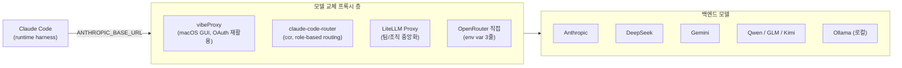

<Callout type="info">
Claude Code 는 API 키 하나로 Anthropic 모델만 쓰도록 설계돼 있어요. 하지만 실전에선 **"간단한 파일 수정까지 Opus 로 돌릴 필요는 없잖아"** 싶을 때가 많습니다. 이 글은 그 틈을 메우는 **모델 교체 프록시 생태계**를 정리합니다.
</Callout>

## 0. 왜 프록시가 필요한가

Claude Code 가 내부적으로 작업에 따라 Opus / Sonnet / Haiku 를 자동 선택한다는 건 많이 알려져 있어요. 그런데 이걸 가만히 두면 **서브에이전트 호출까지 전부 Anthropic 유료 모델**로 나갑니다. 생태계가 해결하는 질문은 두 가지입니다.

1. **구독 재활용** — 이미 Claude Max 나 ChatGPT Pro 를 구독 중인데, 다른 AI 툴에서도 그 할당량을 쓸 수 없을까?
2. **저가 모델 라우팅** — 복잡한 추론은 Opus, 단순 편집·서브에이전트는 DeepSeek·Qwen·Gemini Flash 로 돌려 비용을 낮출 수 없을까?

핵심 수치 한 장으로 말하면, Claude Opus 4.6 의 output 토큰이 **약 $25/M**, DeepSeek V3.2 가 **약 $1.10/M** 입니다. 같은 output 양에 **약 23 배** 차이예요. 백그라운드 작업을 DeepSeek 로 돌리면 월간 비용이 체감 될 정도로 빠집니다. (출처: [MindStudio 비교 분석](https://www.mindstudio.ai/blog/open-router-free-models-claude-code-cost-reduction))

## 1. 프록시 생태계 한 눈 지도



- 프록시 층이 공통으로 하는 일은 **Anthropic Messages API 포맷을 가로채서 OpenAI 호환 포맷으로 번역한 뒤 다른 공급자로 포워딩** 입니다.
- 차이점은 **어떤 식으로 번역하고, 어떤 라우팅 규칙을 제공하느냐**.

## 2. vibeProxy — 구독 재활용에 특화된 GUI

GitHub: [automazeio/vibeproxy](https://github.com/automazeio/vibeproxy) · MIT · 2026-04-11 기준 v1.8.135 · macOS 메뉴바 앱.

- **정체**: API 키 없이 이미 가지고 있는 **구독을 재활용**하는 로컬 프록시 서버. 내부적으로 [CLIProxyAPIPlus](https://github.com/router-for-me/CLIProxyAPI) 를 번들로 포함합니다.
- **인터셉트 방식**: 사용자가 OAuth 로 각 서비스(Claude, ChatGPT, Gemini 등) 에 로그인하면, vibeProxy 가 `~/.cli-proxy-api/` 에 크리덴셜을 저장하고 로컬에서 OpenAI 호환 엔드포인트를 띄웁니다. 클라이언트 툴은 `ANTHROPIC_BASE_URL` 을 그 로컬 주소로 가리키기만 하면 돼요.
- **지원 백엔드**: Claude (Sonnet 4.5 · Opus 4.5 + extended thinking, Claude Max 구독 재활용), GPT-5.1 / GPT-5.1 Codex (ChatGPT 구독), Gemini 3 Pro (Antigravity 경유), GitHub Copilot, Z.AI GLM-4.7, Qwen.
- **플랫폼 제한**: **macOS 전용**. Linux / Windows 는 대안 도구를 써야 합니다.
- **설정 흐름**:
  1. `/Applications` 에 앱 설치
  2. 메뉴바 아이콘 → Settings → "Connect" (OAuth) 또는 "Add Account" (API 키)
  3. 브라우저에서 OAuth 완료 → 크리덴셜 자동 감지
  4. 클라이언트 툴에서 `ANTHROPIC_BASE_URL` 을 vibeProxy 로컬 엔드포인트로 설정
- **활성도**: 2.3k stars. PR #293 에서 per-account usage 모니터링과 모델 그룹(round-robin + failover) 기능이 추가됨. 2026-04-11 당일에도 릴리스가 나올 정도로 활발.

요약하면 vibeProxy 는 **"이미 월정액 내고 있는 AI 서비스들을 한 곳에서 프록시해서 다른 툴에서도 재활용"** 이라는 아주 구체적인 문제에 최적화된 GUI 도구예요. 크로스플랫폼·세밀한 라우팅이 필요한 팀 환경에는 맞지 않습니다.

## 3. 대안 프로젝트 비교

| 항목 | **vibeProxy** | **claude-code-router** | **LiteLLM Proxy** | **OpenRouter 직접** |
|---|---|---|---|---|
| 레포 | [automazeio/vibeproxy](https://github.com/automazeio/vibeproxy) | [musistudio/claude-code-router](https://github.com/musistudio/claude-code-router) | [BerriAI/litellm](https://github.com/BerriAI/litellm) | 호스티드 서비스 |
| 스타 | 2.3k | 32k | 매우 높음 | — |
| 플랫폼 | macOS 전용 | 크로스 (Node.js) | 크로스 (Python) | 클라우드 |
| 설정 복잡도 | 낮음 (GUI) | 중간 (JSON) | 높음 (YAML + 서비스) | 매우 낮음 (env 3줄) |
| 라우팅 규칙 | 모델 그룹 + round-robin/failover | `default / background / think / longContext / webSearch` 역할별 | `config.yaml` 기반 | 환경변수 고정 |
| 비용 전략 | 구독 재활용 | 저가 공급자로 역할별 라우팅 | 저가 공급자 통합 + 로깅 | 저가 모델 직연결 |
| tool calling | 모델 의존 | transformer 로 보정 | 모델 의존 | Anthropic 경유 시 완전 |
| 라이선스 | MIT | MIT | MIT | 상용 |

참고로 한때 유명했던 `y-router` ([luohy15/y-router](https://github.com/luohy15/y-router)) 는 **2026-01-11 부터 archived** 입니다. OpenRouter 가 공식 Claude Code 통합을 내놓으면서 역할이 사라졌어요. 구글링에서 y-router 관련 글을 발견하면 날짜를 확인하세요.

## 4. 공식 문서가 잘 안 짚는 팁

<Callout type="warn" title="DeepSeek 의 tool_choice 함정 — 긴 세션에서 tool calling 이 풀린다">
DeepSeek-V3 / R1 을 claude-code-router 에 붙이면 초반엔 잘 동작하다가 **대화가 길어지면 모델이 tool call 대신 plain text 로 응답하기 시작**하는 버그가 있습니다. Claude Code 쪽에서 보면 "답변만 하고 파일을 안 건드리는" 증상이에요. 원인은 DeepSeek 이 `tool_choice` 힌트를 약하게 해석하기 때문. 해결법은 claude-code-router 의 해당 모델 설정에 `"transformers": ["deepseek", "tooluse"]` 를 넣는 것. `tooluse` transformer 가 `tool_choice: "required"` 를 강제합니다. 공식 DeepSeek 문서엔 없는 내용이고, 커뮤니티 이슈에서만 드러난 해결책이에요. 출처: [claude-code-router issue #716](https://github.com/musistudio/claude-code-router/issues/716).
</Callout>

<Callout type="warn" title="ANTHROPIC_DEFAULT_*_MODEL 환경변수로 역할별 모델 오버라이드">
Claude Code 가 내부적으로 작업 종류에 따라 Opus / Sonnet / Haiku 를 자동 선택한다는 건 알려져 있지만, **이걸 환경변수로 덮어쓸 수 있다**는 사실은 Anthropic 공식 문서에 간접적으로만 언급됩니다. 명시적 예시는 [OpenRouter 공식 Claude Code 통합 문서](https://openrouter.ai/docs/guides/coding-agents/claude-code-integration) 에 있어요. `ANTHROPIC_DEFAULT_OPUS_MODEL`, `ANTHROPIC_DEFAULT_SONNET_MODEL`, `ANTHROPIC_DEFAULT_HAIKU_MODEL`, `CLAUDE_CODE_SUBAGENT_MODEL` 네 개를 OpenRouter 경유 저가 모델로 바꾸면, 복잡한 추론만 비싼 모델이 쓰이고 나머지는 저가 모델이 처리하는 실질적 절감 구조가 완성됩니다.
</Callout>

<Callout type="warn" title="OpenRouter 무료 모델 중 다수는 tool calling 미지원">
OpenRouter 의 "무료" 티어 모델들 중 다수는 function calling 을 아예 지원하지 않습니다. Claude Code 는 오류를 띄우지 않고 그냥 "답변만 하고 파일은 안 건드리는" 상태로 돌아가요. 실전에서 확인된 tool use 가능 저가 모델은 `Qwen3 Coder`, `DeepSeek-V3` (chat 버전) 정도. 모델 선택 시 공급자 문서의 `function_calling: true` 여부를 **반드시** 확인하세요. 출처: [lgallardo.com — Claude Code Router + OpenRouter](https://lgallardo.com/2025/08/20/claude-code-router-openrouter-beyond-anthropic/).
</Callout>

## 5. 실전 설정 예시

### 예시 A. OpenRouter 직접 연결 — 가장 단순 (환경변수 3줄)

```bash
# ~/.zshrc 또는 ~/.bashrc
export OPENROUTER_API_KEY="sk-or-v1-xxxxxxxxxxxx"
export ANTHROPIC_BASE_URL="https://openrouter.ai/api"
export ANTHROPIC_AUTH_TOKEN="$OPENROUTER_API_KEY"
export ANTHROPIC_API_KEY=""   # 반드시 비워야 함 (Anthropic 기본 키와 충돌 방지)

# 역할별 모델 오버라이드 (선택)
export ANTHROPIC_DEFAULT_OPUS_MODEL="anthropic/claude-opus-4-5"
export ANTHROPIC_DEFAULT_SONNET_MODEL="google/gemini-2.5-flash"
export ANTHROPIC_DEFAULT_HAIKU_MODEL="deepseek/deepseek-chat"
export CLAUDE_CODE_SUBAGENT_MODEL="deepseek/deepseek-chat"

claude
```

출처: [OpenRouter 공식 Claude Code 통합 문서](https://openrouter.ai/docs/guides/coding-agents/claude-code-integration).

### 예시 B. claude-code-router — 역할별 JSON 라우팅

파일: `~/.claude-code-router/config.json`

```json
{
  "Providers": [
    {
      "name": "openrouter",
      "api_base": "https://openrouter.ai/api/v1/chat/completions",
      "api_key": "${OPENROUTER_API_KEY}",
      "models": [
        "deepseek/deepseek-chat",
        "google/gemini-2.5-flash",
        "qwen/qwen2.5-coder-32b-instruct"
      ]
    },
    {
      "name": "ollama",
      "api_base": "http://localhost:11434/v1/chat/completions",
      "api_key": "ollama",
      "models": ["qwen2.5-coder:7b"]
    }
  ],
  "Router": {
    "default":     { "provider": "openrouter", "model": "deepseek/deepseek-chat",
                     "transformers": ["deepseek", "tooluse"] },
    "background":  { "provider": "ollama",     "model": "qwen2.5-coder:7b" },
    "think":       { "provider": "openrouter", "model": "google/gemini-2.5-flash" },
    "longContext": { "provider": "openrouter", "model": "google/gemini-2.5-flash",
                     "contextThreshold": 60000 }
  }
}
```

실행:

```bash
npm install -g @musistudio/claude-code-router
ccr activate   # ANTHROPIC_BASE_URL 등 자동 세팅
ccr code       # Claude Code 를 라우터 경유로 실행
```

핵심은 `Router.default` 에 `"tooluse"` transformer 를 꼭 포함시키는 것. DeepSeek 계열을 default 로 쓸 땐 이게 없으면 위의 함정에 걸립니다.

### 예시 C. LiteLLM Proxy — 팀·조직 중앙화

`litellm_config.yaml`:

```yaml
model_list:
  - model_name: claude-sonnet-4-5
    litellm_params:
      model: anthropic/claude-sonnet-4-5-20250929
      api_key: os.environ/ANTHROPIC_API_KEY
  - model_name: claude-sonnet-4-5
    litellm_params:
      model: deepseek/deepseek-chat
      api_key: os.environ/DEEPSEEK_API_KEY
```

```bash
pip install 'litellm[proxy]'
litellm --config litellm_config.yaml --port 4000

export ANTHROPIC_BASE_URL="http://0.0.0.0:4000"
export ANTHROPIC_AUTH_TOKEN="$LITELLM_MASTER_KEY"
claude --model claude-sonnet-4-5
```

LiteLLM 은 같은 `model_name` 에 여러 공급자를 묶어 **자동 fallback 과 로깅**을 중앙에서 처리합니다. 팀에서 여러 명이 공용 키를 쓰는 환경에 맞아요.

### 예시 D. vibeProxy 설치 후 다른 툴과 연동

vibeProxy 를 설치해 OAuth 로그인까지 끝나면 로컬에 Anthropic 호환 엔드포인트가 떠있습니다. Claude Code 뿐 아니라 **Factory Droids, Cursor** 같은 다른 툴에서도 같은 엔드포인트를 재활용할 수 있어요.

```bash
# 메뉴바 앱 Settings 에서 확인한 로컬 포트
export ANTHROPIC_BASE_URL="http://127.0.0.1:<vibeproxy_port>"
export ANTHROPIC_AUTH_TOKEN="any_placeholder"

# 이제 Claude Code 는 Claude Max 구독 토큰으로, 추가 API 요금 없이 동작
claude
```

## 6. 선택 가이드 — "나는 뭘 써야 하지?"

- **이미 Claude Max 구독 중 + macOS 사용자** → **vibeProxy**. 구독 한도 재활용이 가장 큰 이득.
- **개인 개발자, 크로스플랫폼, 역할별 라우팅 필요** → **claude-code-router**. 가장 성숙(32k stars) 하고 JSON 하나만 쓰면 됨.
- **팀·조직, 공용 키, 감사 로그 필요** → **LiteLLM Proxy**. 세팅 복잡하지만 기능이 가장 많음.
- **그냥 저가 모델 한번 써보고 싶음** → **OpenRouter 직접**. 환경변수 3줄이면 끝. 부작용 가장 적음.

## 7. 주의 사항

- Claude Code 는 Anthropic 공식 공급자에 가장 최적화돼 있습니다. 다른 공급자로 라우팅 시 **extended thinking · native tool use 포맷**이 다르게 동작할 수 있어요. 중요한 프로덕션 작업엔 Anthropic 직접 접속을 유지하세요.
- 프록시 경유 시 **응답 지연**이 추가됩니다. 대화형으로는 체감되지만, 긴 배치 작업에선 무시할 만한 수준.
- 어떤 프록시든 API 키가 로컬·서버를 거치므로 **사내 기밀 코드 작업엔 프록시 도입 전 검토** 필요.

## 8. 다음에 읽을 글

- [OMC 슬래시 커맨드 카탈로그](/docs/02-slash-commands/omc-catalog) — OMC 를 프록시와 함께 쓰면 서브에이전트까지 저가 모델로 라우팅되어 체감 절감이 크게 나옵니다
- [Compact 활용법과 CLAUDE.md 메모리 전략](/docs/03-session-context/compact-and-memory) — 프록시 전에 먼저 해야 할 "컨텍스트 위생" 최적화

## 참고 자료 (Primary sources)

**공식 GitHub 레포 (1차 출처)**
- [automazeio/vibeproxy](https://github.com/automazeio/vibeproxy) — vibeProxy, MIT, v1.8.135 (2026-04-11)
- [musistudio/claude-code-router](https://github.com/musistudio/claude-code-router) — 32k stars, 가장 성숙한 Claude Code 라우팅 도구
- [BerriAI/litellm](https://github.com/BerriAI/litellm) — 범용 LLM 프록시
- [router-for-me/CLIProxyAPI](https://github.com/router-for-me/CLIProxyAPI) — vibeProxy 가 번들로 품은 내부 엔진

**공식 문서**
- [OpenRouter — Claude Code Integration](https://openrouter.ai/docs/guides/coding-agents/claude-code-integration) — `ANTHROPIC_BASE_URL` 패턴 공식 출처
- [LiteLLM — Claude Code Quickstart](https://docs.litellm.ai/docs/tutorials/claude_responses_api) — LiteLLM 프록시 세팅

**커뮤니티 검증 (보조 출처)**
- [lgallardo.com — Claude Code Router + OpenRouter](https://lgallardo.com/2025/08/20/claude-code-router-openrouter-beyond-anthropic/)
- [claude-code-router issue #716 (DeepSeek tool calling)](https://github.com/musistudio/claude-code-router/issues/716)
- [MindStudio — OpenRouter 무료 모델로 비용 절감](https://www.mindstudio.ai/blog/open-router-free-models-claude-code-cost-reduction)

---

<Callout type="info">
**Last verified: 2026-04-11** — vibeProxy v1.8.135, claude-code-router 32k stars 기준. 프록시 생태계는 변동이 빠르니 쓰기 전에 각 레포의 최근 이슈·릴리즈를 한 번 더 확인하세요.
</Callout>
